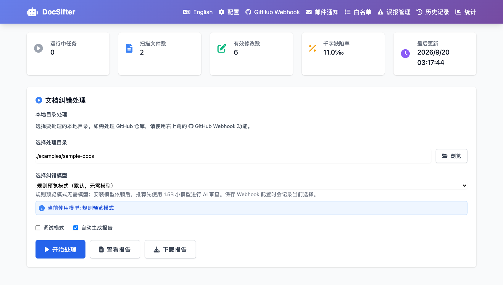
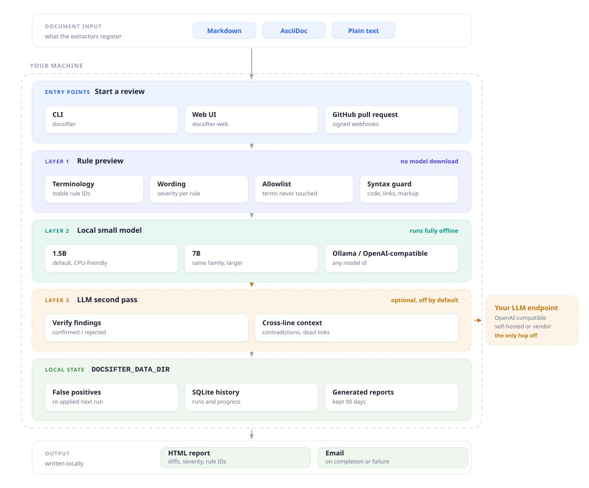
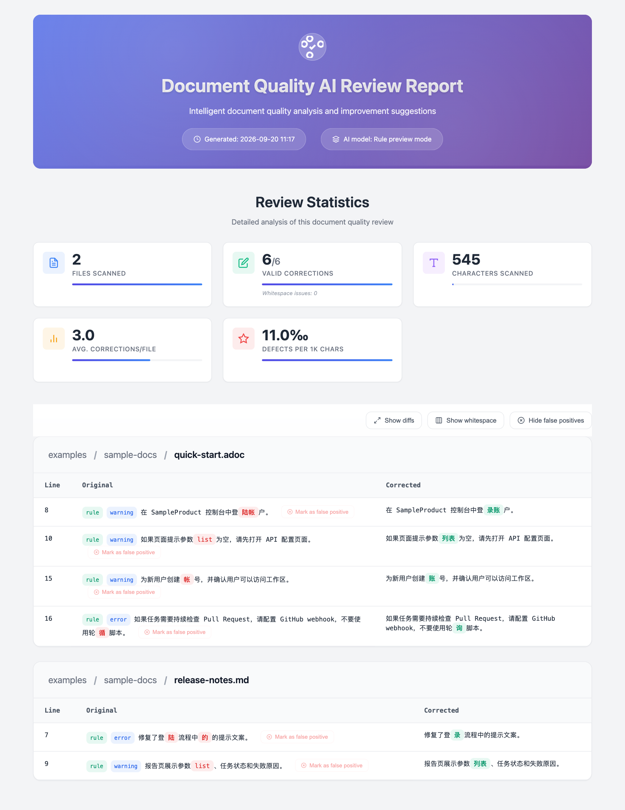

# DocSifter

[](https://github.com/heywalter/docsifter/actions/workflows/ci.yml)
[](https://www.python.org/)
[](LICENSE)

DocSifter 是一个面向技术文档的本地小模型 AI 审查与纠错工具，支持 Markdown、AsciiDoc 和纯文本。它结合本地模型纠错、规则护栏、术语白名单、误报过滤、GitHub PR 监控和邮件通知，帮助文档团队在发布前批量审查文档。

语言：[English](README.md) | 简体中文

**[看它实际跑起来](https://flowingdocs.com/demos/docsifter/)** —— 滚动式介绍页，含两分多钟的演示视频。



## 为什么做这个项目

技术文档里满是拼写检查不该碰的东西：产品名、SQL、shell 命令、生成的示例、标记语法。云端大模型
在语言质量上有帮助，但很难塞进一个私有的文档流程；通用纠错工具会改坏技术细节；纯规则检查又
覆盖不到其余部分。

DocSifter 处在中间：规则层只改它能证明的，本地小模型处理剩下的，白名单和语法保护让两者都远离
那些"本来就是故意这么写"的地方。除非你自己配置了远端端点，否则数据不会离开本机。

名字就是行为：sift（筛）留下重要的、挑出不该在的——错别字、别扭的措辞、重复的词——而代码、
SQL、API 名和领域术语留在屏幕上。

- 批量审阅 `.md`、`.adoc`、`.txt` 等文本文件，CLI 和 Web 界面都可以。
- 每条发现都带来源（`rule` / `model`）、严重级别和规则 ID。
- 自包含的 HTML 报告，含差异对比、统计和千字缺陷率。
- 误报管理，跨多次运行持续生效。
- 通过签名 webhook 审阅 GitHub PR，并支持邮件通知。
- 可选的 agent 层做跨文件审阅，规则契约见 [AGENTS.md](AGENTS.md)。

## 分层 AI 审阅

<picture>
  <source media="(prefers-color-scheme: dark)" srcset="docs/images/architecture-dark.svg">
  
</picture>

CLI 和 Web UI 都从规则预览起步，首次运行不会隐式下载数 GB 的模型权重。

这里没有任何一层会跨文件阅读。失效的锚点和 include、跨页面的术语漂移、已经落后于产品的描述
——这类需要仓库上下文的问题，可以配合 Codex 这样能读仓库的 agent，
[AGENTS.md](AGENTS.md) 就是为此准备的规则契约。DocSifter 本身不依赖 Codex 运行：它是本地
检查之上的可选层，不是依赖项。

## 纠错模型

本地层使用三个模型之一，首次选用时从 Hugging Face 下载：

| 模型 | 平均 F1 | 说明 |
| --- | --- | --- |
| `shibing624/chinese-text-correction-1.5b` | 0.68 | 默认。约 3.1 GB，对 CPU 最友好；下文 DocSifter 自己的实测都基于它。 |
| `twnlp/ChineseErrorCorrector3-4B` | **0.85** | 三者中最高，来自 [ChineseErrorCorrector](https://github.com/TW-NLP/ChineseErrorCorrector)，体量也装得进 12 GB 显卡。本项目未验证。 |
| `shibing624/chinese-text-correction-7b` | 0.82 | 与默认同系列，更大。本项目未验证：开发用的显卡装不下。 |

平均 F1 是 pycorrector 榜单上 SIGHAN-2015、EC-LAW、MCSC 三个数据集的均值，测试环境为
Tesla V100——分数据集的明细见各自的
[模型卡片](https://huggingface.co/shibing624/chinese-text-correction-1.5b)，以及发布同一份
评测的 ChineseErrorCorrector。这些数字描述的是模型本身。

DocSifter 在模型外面加的那一层效果如何是另一个问题，
[`benchmarks/README.md`](benchmarks/README.md) 用一个 76 条标注语料集回答：

| 类别 | 仅规则 | 规则 + 1.5B 模型 |
| --- | --- | --- |
| 术语 terminology（24） | 改对 24，改错 0 | 改对 24，改错 0 |
| 错别字 typo（19） | 改对 0 | 改对 15，改错 3 |
| 语法 grammar（13） | 改对 1，改错 0 | 改对 3，改错 4 |
| 保护样本 protection（16 反例） | 16 条未被改动 | 16 条未被改动 |

请把它理解为各层能力的形状，而不是准确率指标：76 条支撑不了一个准确率数字，而语法只有
13 条，一条的变动就会让那一行浮动 8 个百分点。它真正说明的是两层为什么都要存在：错别字
是模型存在的理由，规则层对它完全无能为力；语法则是模型最弱的地方，改对和改错的次数差不多
——这也正是每条发现都带来源标记、`model` 来源只作为建议而非定论的原因。两层都没有动过任何
一条保护样本。


### 使用其他模型

这两个是本地白名单——Web UI 不会用列表之外的模型启动审阅——但不是全部选择。有三层都要用到
模型，每一层都能指向别处：

| 层 | 作用 | 开关 |
| --- | --- | --- |
| 纠错后端 | 把本地运行时换成 Ollama 或任意 OpenAI 兼容端点，后者接受任意模型 id（`qwen2.5:7b`、`gpt-4o-mini` 等）。 | `DOCSIFTER_MODEL_BACKEND=local\|ollama\|openai` |
| [二次复核](#可选-llm-层) | 把小模型改过的那条发给更大的模型判定。默认关闭。 | `DOCSIFTER_LLM_REVIEW_ENABLED` |
| [跨行上下文审阅](#可选-llm-层) | 发送整篇文档，找矛盾表述和失效引用。默认关闭。 | `DOCSIFTER_CONTEXT_REVIEW_ENABLED` |

```bash
export DOCSIFTER_MODEL_BACKEND=ollama
export DOCSIFTER_OLLAMA_BASE_URL=http://127.0.0.1:11434

# 或任意 OpenAI 兼容端点：vLLM、DashScope、OpenRouter、OpenAI
export DOCSIFTER_MODEL_BACKEND=openai
export DOCSIFTER_OPENAI_BASE_URL="https://your-endpoint.example.com/v1"
export DOCSIFTER_OPENAI_API_KEY="..."
```

所有后端共用同一套保护机制——代码、URL、占位符和白名单词在调用前被屏蔽，未通过安全校验的
输出被丢弃——出错时明确失败而不静默降级，API Key 只留在内存里。用远端后端意味着待审文本会
离开本机，文档敏感时请指向自建服务。

信任某个后端之前，先用基准语料给它打个分：

```bash
python3 benchmarks/run_benchmark.py --backend ollama --base-url http://127.0.0.1:11434 --model qwen2.5:7b
python3 benchmarks/run_benchmark.py --backend openai --base-url https://your-endpoint.example.com/v1 --model your-model
```

### 硬件要求

| 路径 | 需要什么 |
| --- | --- |
| 规则预览 | 没有特别要求：不下载模型，不需要显卡。 |
| 1.5B 跑 CPU | 能跑，但慢。系统内存至少 8 GB，16 GB 更从容。 |
| 1.5B 跑 GPU | 推荐配置，本项目就是在这张卡上开发的：RTX 3060 12 GB 可以轻松装下。 |
| 4B 跑 GPU | 本项目未验证，但 fp16 下权重约 8 GB，12 GB 显卡放得下。 |
| 7B 跑 GPU | 本项目未验证。fp16 下仅权重就约 14 GB，超出 12 GB 显存，需要更大的卡。 |

4B 和 7B 本项目都没有实际跑过——7B 是 12 GB 显存装不下、也没有更大的卡，4B 则是看它公布的
分数加进来的。这两行请当作推算，而不是实测经验。

显卡是推荐项而非必需项——每一层都能在 CPU 上跑，规则层更是完全不加载模型。显卡买到的是
周转速度：模型卡片上每秒 6 次查询是在 Tesla V100 上测的，CPU 推理远低于这个数。

## 快速开始

**推荐——本地小模型 AI 审查：**

```bash
python -m venv .venv
source .venv/bin/activate
pip install "docsifter[model] @ git+https://github.com/heywalter/docsifter.git"

docsifter ./examples/sample-docs --model shibing624/chinese-text-correction-1.5b
```

从源码检出安装时用 `pip install -e ".[model]"`。

首次运行会下载模型（约 3.1 GB），后续使用缓存副本。如果所选模型或模型运行时
无法加载，任务会返回可操作的错误，不会静默降级为规则预览。

模型下载到 Hugging Face 缓存目录，默认位于用户主目录。系统盘空间紧张时，
请在首次运行前把缓存指向其他卷（两个变量要指向一致的路径）：

```bash
export HF_HOME=/Volumes/YourDisk/docsifter/model-cache/huggingface
export HUGGINGFACE_HUB_CACHE="$HF_HOME/hub"
```

务必写成两条语句。写成一条 `export HF_HOME=... HUGGINGFACE_HUB_CACHE=$HF_HOME/hub` 时，
shell 会在第一个赋值生效前就展开 `$HF_HOME`，缓存路径会静默变成 `/hub`，
模型加载随后因只读路径失败。

**仅规则预览**，不下载模型：

```bash
pip install git+https://github.com/heywalter/docsifter.git
docsifter ./examples/sample-docs
```

CLI 还接受这些：

```bash
docsifter /path/to/documents --output report.html
docsifter /path/to/documents --config custom_config.json
docsifter /path/to/documents --debug      # 逐行跟踪，DEBUG 级别
```

扫描默认跳过 `.git`、`.venv`、`node_modules`、`dist`、`build` 和常见缓存，也跳过符号链接和
超过 `max_file_size_mb`（默认 5）的文件——链接会解析到被审目录之外，而审阅是串行的，一个
超大文件会拖住后面所有任务。项目自己的排除规则用 `skip_file_patterns` 添加。

安装：Python 3.10+，macOS / Linux / Windows；硬件要求见[硬件要求](#硬件要求)。
`pip install -e ".[model]"` 用于源码检出。DocSifter 尚未发布到 PyPI，上面两条命令直接从本仓库安装。

**Web 界面：**

```bash
docsifter-web
```

浏览器访问 `http://localhost:8080`。

页面不从网络加载任何资源：Tailwind 和 Font Awesome 已随包内置在
`src/docsifter/static/vendor/` 下，内网和离线环境的显示效果与联网时一致，也不会让 CDN
看到谁在用。生成的报告同样是自包含文件。

## 审阅规则

内置规则保持保守，每条规则都包含稳定 ID、说明、严重级别和正文作用域。处理规则前会保护
代码块、行内代码、链接、URL、白名单术语和标记语法。法律或行业语境相关的措辞不进入
全局默认规则，应由项目配置提供。

报告会区分 `rule`、`model` 和 `rule+model`。规则命中后，小模型仍会继续检查句子中的
其他问题。建议只让确定性的规则错误阻断 CI；模型发现默认交给人工确认，除非团队已经用
自己的文档语料验证过准确率。

## 配置

DocSifter 默认将可变配置、误报记录、审查历史和生成报告保存到
`./data`。需要指定其他可写目录时，设置 `DOCSIFTER_DATA_DIR`：

```bash
export DOCSIFTER_DATA_DIR="/var/lib/docsifter"
export DOCSIFTER_ALLOWED_ROOTS="/srv/docs:/srv/product-docs"
export DOCSIFTER_ADMIN_TOKEN="replace-with-a-long-random-token"
export DOCSIFTER_GITHUB_TOKEN="..."
export DOCSIFTER_EMAIL_PASSWORD="..."
export DOCSIFTER_EMAIL_RECIPIENTS="docs@example.com,review@example.com"
```

完整变量列表见 [.env.example](.env.example)。需要显式配置文件时，复制
[config.json.example](config.json.example) 再用 `--config` 指定。环境变量提供的值不会被
回写到 `config.json`。

Web 界面默认只能浏览启动目录，`DOCSIFTER_ALLOWED_ROOTS` 可以放宽为一个路径分隔符分隔的列表
（macOS/Linux 用 `:`，Windows 用 `;`），CLI 不受此限制。GitHub Token 同时用于 API 请求和
非交互式 Git，因此审查私有仓库时不必把凭据写进克隆 URL。

有两份随项目提供的列表值得早点改：
[whitelist.json](src/docsifter/whitelist.json) 是绝不纠错的术语白名单，
[false_positives.json](src/docsifter/false_positives.json) 是误报过滤的初始数据；你之后做的
判断会保存到 `DOCSIFTER_DATA_DIR`。

### 日志与指标

设置 `DOCSIFTER_LOG_FORMAT=json` 可输出单行 JSON 日志（默认纯文本），
`DOCSIFTER_LOG_LEVEL` 控制日志级别。格式化器安装在 root logger 上，所有模块都通过它
输出：逐文件进度、启动信息、审阅完成指标、纠错保护层的告警、邮件子系统、数据保留、
`--debug` 跟踪，以及 Web 服务的请求与错误日志。

两条流是有意分开的：日志走 stderr，CLI 的**结果**（报告路径和统计块）走 stdout，
因此可以各取所需：

```bash
docsifter ./docs 2>/dev/null                 # 只要结果
DOCSIFTER_LOG_FORMAT=json docsifter ./docs \
    2>&1 1>/dev/null | jq -r .message        # 只要日志流
```

`2>&1 1>/dev/null` 的顺序不能调换：`2>&1` 把 stderr 指向此刻的 stdout（也就是管道），
之后才把 stdout 丢进 `/dev/null`。反过来写的话管道收不到任何东西，日志会直接打到终端上。

`--debug` 会把本次运行的日志级别提到 `DEBUG`，逐行纠错跟踪才会出现。它与 Flask 的
调试器无关——Web 服务永远不会带着 Flask debugger 启动。

Web 服务在 `/metrics` 端点以 Prometheus 文本格式暴露进程内的审阅计数与耗时指标——零额外依赖。

## 可选 LLM 层

有两层可以把活交给更大的模型，走任意 OpenAI 兼容的 `chat/completions` 接口。两层默认都关闭，
不配置端点就不会发送任何内容。

```bash
export DOCSIFTER_LLM_ENDPOINT="https://your-endpoint.example.com/v1"
export DOCSIFTER_LLM_MODEL="qwen2.5-72b-instruct"
export DOCSIFTER_LLM_API_KEY="..."

export DOCSIFTER_LLM_REVIEW_ENABLED=true      # 二次复核
export DOCSIFTER_CONTEXT_REVIEW_ENABLED=true  # 跨行上下文审阅
export DOCSIFTER_PR_LLM_ENABLED=true          # 允许 PR 路径也用这两层
```

**二次复核**逐条检查小模型改过的内容，规则修复直接采信。`llm_max_reviews`（默认 20）限制的是
**单次运行**的条数。每条送审的修改都会在报告里带徽章——`confirmed` / `rejected`（含理由）、
预算用完的 `skipped`、请求失败的 `error`——被否决的行灰显而不是删除。

**跨行上下文审阅**找只有跨行阅读才能发现的问题：术语不一致、表述矛盾、引用了不存在的章节或
链接。发现项标记为 `context`，不自动改写，也不参与误报过滤。每个文件最多 10 条问题、每次请求
最多 200 行抽取正文，日志会说明剩下多少行没审。

第二层要单独估算成本：它按文件发送**整篇正文**，而第一层只发改动过的句子且封顶 20 条——在本
项目自己的 10 个 Markdown 上实测，差两百多倍。所以 `context_review_scope` 默认 `flagged`，只审
已有发现的文件；`all` 才审每个文件（干净文件同样可能自相矛盾）。`context_max_files`（默认 50）
对两种范围都生效。如果你本来就打算为整篇文档付费，能读多个文件的 agent 用同样的 token 能看到
更多。

`DOCSIFTER_PR_LLM_ENABLED` 是**路径开关，不是第三层**：PR 审阅无人值守、与本地审阅共用同一把
串行锁，所以单独开启。两层各自的开关和上限照常生效，两层都关时打开它没有任何效果。任何端点
故障都只记录并跳过，不会中断审阅。

Web 界面的「大模型复核」面板可以配置以上全部。被环境变量锁定的值会显示为锁定状态，浏览器无法
覆盖部署配置；在面板里输入的 Key 不会写入 `config.json`；端点和模型没填之前，两层都开不了。

## 数据保留

审阅历史、监控日志和报告文件默认保留 90 天（`retention_days`，设 `0` 表示永久），在 Web 启动时
清理一次，不会打断进行中的审阅。删除历史记录会一并删除它引用的报告，无人引用的孤儿文件按文件
时间清理，仍被保留期内记录引用的报告则无论多旧都保留。

## Web 界面

```bash
docsifter-web                              # http://localhost:8080
docsifter --server --port 8080             # 指定端口

# 允许局域网访问，此时必须配置 Token
export DOCSIFTER_ADMIN_TOKEN="$(python -c 'import secrets; print(secrets.token_urlsafe(32))')"
docsifter --server --port 8080 --host 0.0.0.0
```

默认主机为 `127.0.0.1`，只允许本机访问。设置 `DOCSIFTER_ADMIN_TOKEN` 后，
Web UI 和管理 API 会启用 HTTP Basic/Bearer 鉴权。浏览器登录时用户名可任意
填写（例如 `docsifter`），密码填写该 Token。监听非回环地址或配置 `DOCSIFTER_PUBLIC_URL` 时，
必须同时配置至少 24 个字符的管理员 Token。

每次审阅都会生成一份自包含的 HTML 报告：先是本次运行的统计，然后逐条列出发现——
原文、建议改法、命中的规则及其严重级别。任何一条都可以直接在报告里标记为误报，
该过滤会在后续审阅中生效。



## API 示例

```bash
curl -X POST http://localhost:8080/api/process \
  -H "Content-Type: application/json" \
  -d '{"directory": "./examples/sample-docs", "debug": true}'
```

该接口返回 `202 Accepted` 和任务 ID。任务在后台运行，可通过
`GET /api/history/{task_id}` 查询状态与进度。
启用管理员鉴权后，API 客户端需要发送 `Authorization: Bearer <token>`；
写操作还需要发送 `X-DocSifter-Request: 1`。

常用接口：

- `POST /api/process`：启动审查任务。
- `GET /api/history/{task_id}`：查看任务状态和详情。
- `GET /api/history`：查看历史记录。
- `GET /api/history/{task_id}/download`：下载报告。

## GitHub PR 监控

DocSifter 可以通过签名 GitHub Webhook 审查 Pull Request。
监控由 Webhook 事件驱动：DocSifter 当前不运行后台 GitHub 轮询服务。

1. 先生成足够长的管理员 Token，再配置 GitHub 可以访问的公网地址；`localhost`
   不能作为 Webhook 目标：

   ```bash
   export DOCSIFTER_ADMIN_TOKEN="$(python -c 'import secrets; print(secrets.token_urlsafe(32))')"
   export DOCSIFTER_PUBLIC_URL="https://review.example.com"
   docker compose up --build
   ```

   容器使用单 worker Gunicorn，并只映射到宿主机回环地址。通过可信反向代理终止
   HTTPS。只允许 `/api/github/webhook` 跳过管理员鉴权，
   Web UI 和其他 API 必须保持受保护；Webhook 本身仍要求有效的 GitHub 签名。
2. 使用任意用户名（例如 `docsifter`）和管理员 Token 登录 Web UI，打开 GitHub 监控。
3. 在主界面选择审阅模型，再到 GitHub 监控中输入仓库 URL。自动审阅会使用已保存的选择；安装模型运行时后再选择推荐的 1.5B 模型。
4. 保存监控配置，复制生成的 Webhook URL 和 Secret。Secret 只会在首次创建或主动轮换时显示。
5. 在 GitHub 仓库中添加 Webhook，Content type 选择 `application/json`，填入 Secret，并启用 Pull request 事件。
6. 保持“仅处理变更文件”开启，以加快 PR 审查。

邮件通知使用邮件面板或环境变量中的 SMTP 配置。用户名和密码是可选的：留空则不做认证直接投递，
内网转发服务器通常就是这种配置。“发送测试邮件”在总开关关闭时也能用，方便先测通再开启。监控状态、审查历史、生成报告和日志都保存在
`DOCSIFTER_DATA_DIR` 中。为保证本地模型、统计数据和报告彼此隔离，审查任务会依次执行。
服务重启时遗留的任务会被标记为失败，不会永久停留在运行状态。系统使用 GitHub
Delivery ID 去重 Webhook 重试，同时保留后续 PR 更新事件。

## Docker

```bash
docker compose up --build

# 或直接用 Docker
docker build -t docsifter .
docker run --rm -p 127.0.0.1:8080:8080 -v docsifter-data:/app/data docsifter

# 模型运行时需显式开启，镜像会大很多
docker build --build-arg INSTALL_MODEL_RUNTIME=true -t docsifter:model .
DOCSIFTER_INSTALL_MODEL_RUNTIME=true docker compose up --build
```

运行数据和模型缓存都在 `docsifter-data` volume 里。容器以非 root 用户、单个 Gunicorn
worker 运行，保证进程内模型和任务队列不跨 worker 共享。

## 部署拓扑

DocSifter 是刻意的单实例服务：每个 `DOCSIFTER_DATA_DIR` 只跑一个进程。进行中的任务在进程
内存里、由进程内锁串行，历史是该目录下的一个 SQLite 文件，报告和日志是它旁边的普通文件。
多副本共享同一个数据目录会同时破坏这三点——进度请求可能落到不持有该任务的副本上、Webhook
去重跨不了副本、多个 worker 争用同一个 SQLite。

先纵向扩容，再把推理挪到独立的 Ollama 或 OpenAI 兼容服务上让 Web 层保持轻量，并在反向代理
后面保持 `replicas: 1`。面向多副本的外部任务存储已列入路线图。

## 开发

环境搭建、测试、lint、基准运行和内置资源的重新生成都在
[CONTRIBUTING.md](CONTRIBUTING.md) 里，CI 会在每个 PR 上执行这些检查。

新增文件格式只需注册一个提取器，不用改纠错引擎：

```python
from docsifter.extractors import register_text_extractor


@register_text_extractor((".rst",))
def extract_rst(content):
    # 返回 (行号, 原始行, 纯文本) 三元组的列表。
    ...
```

## 项目资源

- 版本记录：[CHANGELOG.md](CHANGELOG.md)
- 路线图：[ROADMAP.md](ROADMAP.md)（英文）
- 安全策略：[SECURITY.md](SECURITY.md)
- 贡献指南：[CONTRIBUTING.md](CONTRIBUTING.md)
- 演示页面：[DocSifter，滚动即筛](https://flowingdocs.com/demos/docsifter/)
- 发布文章：[DocSifter 开源了](https://flowingdocs.com/blog/docsifter-open-source/)
- Codex 审阅文章：[AI content review with Codex](https://flowingdocs.com/blog/ai-content-review-with-codex/)
- 项目实践文章：[Building a local AI content review system](https://flowingdocs.com/blog/building-a-local-ai-content-review-system/)

## 安全

请不要提交本地凭据、Token、生成报告或数据库文件。默认情况下，`config.json`、`.env`、本地报告、日志和 SQLite 数据库都已被忽略。

如果准备公开一个曾经提交过真实凭据的仓库，请先轮换凭据，并在公开前清理 Git 历史。

## 许可证

本项目使用 MIT License，详见 [LICENSE](LICENSE)。

## 致谢

本项目使用了 Flask、Tailwind CSS、SQLAlchemy、SQLite，以及 pycorrector 等可选本地模型工具。

Tailwind CSS 和 Font Awesome Free 随包分发以保证 Web UI 离线可用，许可证声明见
[THIRD-PARTY-NOTICES.md](THIRD-PARTY-NOTICES.md)。
