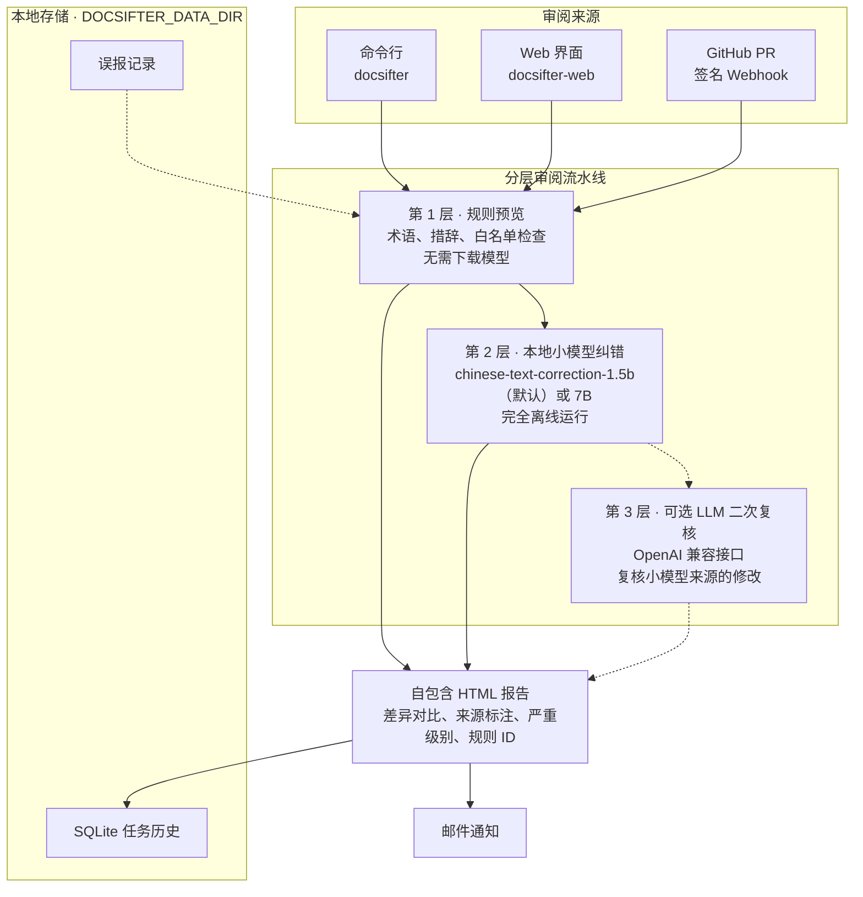

# DocSifter

[](https://github.com/heywalter/docsifter/actions/workflows/ci.yml)
[](https://www.python.org/)
[](LICENSE)

DocSifter 是一个面向技术文档的本地小模型 AI 审查与纠错工具，支持 Markdown、AsciiDoc 和纯文本。它结合本地模型纠错、规则护栏、术语白名单、误报过滤、GitHub PR 监控和邮件通知，帮助文档团队在发布前批量审查文档。

语言：[English](README.md) | 简体中文

## 为什么做这个项目

技术文档里经常包含产品术语、代码片段、SQL 示例、生成内容和不能随意改写的标记语法。云端 AI 工具会带来隐私和审查可控性问题，通用纠错工具容易误改技术细节，而纯规则检查又覆盖不足。DocSifter 的目标是在本地 AI 能力、准确率和工程可控性之间取得平衡：

- 使用本地小模型处理需要更深语义判断的文档纠错。
- 通过规则、白名单和跳过策略保护专业术语。
- 支持命令行和 Web 界面批量审查。
- 生成包含统计、差异和缺陷率的 HTML 报告。
- 通过签名 Webhook 支持 GitHub Pull Request 监控。
- 通过环境变量管理敏感配置，避免提交凭据。

## 背景故事

DocSifter 来自一个很具体的文档发布痛点：数据库手册、发布说明和开发者指南需要语言审查，但普通拼写检查经常误改 SQL、产品名、AsciiDoc 语法和技术术语。大模型可以改善语言质量，却不总是适合私有文档流程：团队需要本地运行、行为可控、结果可追溯。

于是它逐步变成一个给技术写作者和工程师使用的本地审查工作台：本地小模型负责 AI 辅助纠错，规则处理稳定高频问题，白名单保护领域词汇，HTML 报告让审查过程可追溯。轻量规则预览模式方便首次体验；安装模型依赖后，才进入完整的小模型 AI 审查流程。

DocSifter 的名字来自 sift（筛）：一行一行地过，耐心、精细、有边界。筛子把错字病句、重复用词筛出来，而代码片段、SQL、API 名称和领域术语这些值得保留的内容，稳稳留在筛面上。

## 功能特性

- 批量扫描 `.md`、`.adoc`、`.txt` 等文本文件。
- 通过 `pycorrector` 和本地模型进行小模型 AI 纠错。
- 提供规则护栏，覆盖常见措辞和术语修正。
- 在报告中标注发现来源、严重级别和规则 ID。
- 支持误报管理，适合重复审查。
- 生成 HTML 报告，展示统计、差异和质量指标。
- Web 界面提供实时进度、历史记录、配置管理和报告下载。
- 支持 GitHub Pull Request 监控与自动审查流程。
- 支持任务完成后的邮件通知。
- 可配合 Codex 做深度上下文审阅，并通过 [AGENTS.md](AGENTS.md) 沉淀可复用规则。

## 分层 AI 审阅



DocSifter 适合作为 Docs-as-Code 流程里的本地审阅层。默认的轻量规则预览路径可以让贡献者快速检查，不需要安装模型依赖；推荐的小模型 AI 路径从 `shibing624/chinese-text-correction-1.5b` 开始，它是默认模型列表里最适合 CPU 尝试的 AI 模型。CLI 和 Web UI 首次执行时使用规则预览，避免隐式下载数 GB 模型权重；主动选择 AI 审阅后，1.5B 是默认推荐后端。

对于更依赖仓库上下文的问题，可以把 DocSifter 和 Codex Local 或 Codex Cloud 配合使用。Codex 层更适合处理句子级纠错之外的问题：

- 链接、锚点、include 和侧边栏路径是否失效。
- 跨页面术语漂移、重复解释或互相冲突的说明。
- 文档描述是否已经落后于当前产品行为。
- 发布说明、迁移指南和 API 参考的一致性。

仓库根目录提供 [AGENTS.md](AGENTS.md) 作为 Codex 辅助审阅的规则契约。DocSifter 本身不依赖 Codex 运行；Codex 是可选的深度上下文审阅层，适合在本地小模型检查之上做 agent-based review。

## 快速开始

**推荐——本地小模型 AI 审查：**

```bash
python -m venv .venv
source .venv/bin/activate
pip install "docsifter[model]"

docsifter ./examples/sample-docs --model shibing624/chinese-text-correction-1.5b
```

从源码检出安装时用 `pip install -e ".[model]"`。

首次运行会下载模型（约 3.1 GB），后续使用缓存副本。如果所选模型或模型运行时
无法加载，任务会返回可操作的错误，不会静默降级为规则预览。

模型下载到 Hugging Face 缓存目录，默认位于用户主目录。系统盘空间紧张时，
请在首次运行前把缓存指向其他卷（两个变量要指向一致的路径）：

```bash
export HF_HOME=/Volumes/YourDisk/docsifter/model-cache/huggingface
export HUGGINGFACE_HUB_CACHE="$HF_HOME/hub"
```

务必写成两条语句。写成一条 `export HF_HOME=... HUGGINGFACE_HUB_CACHE=$HF_HOME/hub` 时，
shell 会在第一个赋值生效前就展开 `$HF_HOME`，缓存路径会静默变成 `/hub`，
模型加载随后因只读路径失败。

**仅规则预览**（无需下载模型，仅限规则检查）：

```bash
pip install -e .
docsifter ./examples/sample-docs
```

**Web 界面：**

```bash
docsifter-web
```

浏览器访问 `http://localhost:8080`。

页面不从网络加载任何资源。Tailwind CSS 和 Font Awesome 已随包内置在
`src/docsifter/static/vendor/` 下，因此内网和离线环境下的显示效果与联网时一致，
也不会让 CDN 看到谁在使用它。生成的 HTML 报告同样是自包含文件。修改页面结构后，
用 `python3 tools/build_vendor_assets.py` 重新生成内置资源；其中的 Tailwind
只保留界面实际用到的 class。

## 安装

环境要求：

- Python 3.10+
- macOS、Linux 或 Windows
- CPU 尝试 1.5B 模型至少需要 8 GB 内存，建议使用 16 GB

从源码安装：

```bash
pip install .
```

该命令会安装 `docsifter` 和 `docsifter-web` 两个命令以及轻量运行依赖。相同的依赖也列在
`requirements.txt` 中，供开发使用。需要使用 DocSifter 的核心本地小模型纠错流程时，加上 `model` 附加依赖：

```bash
pip install "docsifter[model]"          # 源码检出：pip install -e ".[model]"
docsifter ./examples/sample-docs --model shibing624/chinese-text-correction-1.5b
```

`requirements-model.txt` 保留了同一组版本约束，供 Docker 构建使用——它在拷入源码之前就要装好这些依赖。

轻量规则预览模式不需要 GPU。本地模型纠错也可以在无 GPU 环境下运行，但速度会慢很多，并且会受所选模型的内存需求影响。推荐先使用 `shibing624/chinese-text-correction-1.5b`，因为它是支持列表里对 CPU 最友好的 AI 模型；如果需要更高质量，并且有足够内存或 GPU 加速，再选择同系列 7B 模型。

## 审阅规则

内置规则保持保守，每条规则都包含稳定 ID、说明、严重级别和正文作用域。处理规则前会保护
代码块、行内代码、链接、URL、白名单术语和标记语法。法律或行业语境相关的措辞不进入
全局默认规则，应由项目配置提供。

报告会区分 `rule`、`model` 和 `rule+model`。规则命中后，小模型仍会继续检查句子中的
其他问题。建议只让确定性的规则错误阻断 CI；模型发现默认交给人工确认，除非团队已经用
自己的文档语料验证过准确率。

## 配置

DocSifter 默认将可变配置、误报记录、审查历史和生成报告保存到
`./data`。需要指定其他可写目录时，设置 `DOCSIFTER_DATA_DIR`：

```bash
export DOCSIFTER_DATA_DIR="/var/lib/docsifter"
export DOCSIFTER_ALLOWED_ROOTS="/srv/docs:/srv/product-docs"
export DOCSIFTER_ADMIN_TOKEN="replace-with-a-long-random-token"
export DOCSIFTER_GITHUB_TOKEN="..."
export DOCSIFTER_EMAIL_PASSWORD="..."
export DOCSIFTER_EMAIL_RECIPIENTS="docs@example.com,review@example.com"
```

仅在需要显式配置文件时复制示例，例如在项目脚本中使用：

```bash
cp config.json.example config.local.json
docsifter ./examples/sample-docs --config config.local.json
```

完整变量列表见 [.env.example](.env.example)。

Web 界面默认只能浏览和审阅服务启动目录。可通过 `DOCSIFTER_ALLOWED_ROOTS`
配置允许访问的根目录列表，多个目录使用操作系统路径分隔符分隔（macOS/Linux
使用 `:`，Windows 使用 `;`）。该限制只作用于 Web，CLI 仍可审阅显式指定的目录。
环境变量提供的敏感值不会被回写到 `config.json`。

常用配置文件：

- [config.json.example](config.json.example)：本地配置模板。
- [whitelist.json](src/docsifter/whitelist.json)：不会被纠错的术语白名单。
- [false_positives.json](src/docsifter/false_positives.json)：随项目提供的误报初始数据；本地决策会保存到
  `DOCSIFTER_DATA_DIR`。

GitHub Token 同时用于 API 请求和非交互式 Git 操作，因此可以审查私有仓库，
且不会把凭据写入克隆 URL。

### 日志与指标

设置 `DOCSIFTER_LOG_FORMAT=json` 可输出单行 JSON 日志（默认纯文本），
`DOCSIFTER_LOG_LEVEL` 控制日志级别。格式化器安装在 root logger 上，所有模块都通过它
输出：逐文件进度、启动信息、审阅完成指标、纠错保护层的告警、邮件子系统、数据保留、
`--debug` 跟踪，以及 Web 服务的请求与错误日志。

两条流是有意分开的：日志走 stderr，CLI 的**结果**（报告路径和统计块）走 stdout，
因此可以各取所需：

```bash
docsifter ./docs 2>/dev/null                 # 只要结果
DOCSIFTER_LOG_FORMAT=json docsifter ./docs \
    2>&1 1>/dev/null | jq -r .message        # 只要日志流
```

`2>&1 1>/dev/null` 的顺序不能调换：`2>&1` 把 stderr 指向此刻的 stdout（也就是管道），
之后才把 stdout 丢进 `/dev/null`。反过来写的话管道收不到任何东西，日志会直接打到终端上。

`--debug` 会把本次运行的日志级别提到 `DEBUG`，逐行纠错跟踪才会出现。它与 Flask 的
调试器无关——Web 服务永远不会带着 Flask debugger 启动。

Web 服务在 `/metrics` 端点以 Prometheus 文本格式暴露进程内的审阅计数与耗时指标——零额外依赖。

## 使用方式

审查目录：

```bash
docsifter /path/to/documents
```

审查公开示例文档：

```bash
docsifter ./examples/sample-docs
```

示例目录故意放入了几个常见错误，例如“登陆”“帐户”“参数list”，方便首次运行时直接看到报告效果。

目录扫描默认跳过 `.git`、`.venv`、`node_modules`、`dist`、`build` 和常见缓存目录。
同时跳过符号链接与超过 `max_file_size_mb`（默认 5）的文件：链接会解析到被审阅目录之外，
而审阅是串行的，一个超大文件会拖住后面所有任务。
项目自己的排除规则可以通过 `skip_file_patterns` 增加。

指定报告输出路径：

```bash
docsifter /path/to/documents --output report.html
```

指定配置文件：

```bash
docsifter /path/to/documents --config custom_config.json
```

启用调试输出：

```bash
docsifter /path/to/documents --debug
```

## 可选 LLM 二次复核

小模型来源的修改意见可以在进入报告前交给第二个 LLM 复核。该层默认关闭，只有显式配置端点后才会外发数据。它面向 OpenAI 兼容的 `chat/completions` 接口（vLLM、Ollama、DashScope、OpenRouter、OpenAI 等），指向自建服务即可保持全程内网。

```bash
export DOCSIFTER_LLM_REVIEW_ENABLED=true
export DOCSIFTER_LLM_ENDPOINT="https://your-endpoint.example.com/v1"
export DOCSIFTER_LLM_MODEL="qwen2.5-72b-instruct"
export DOCSIFTER_LLM_API_KEY="..."
docsifter ./examples/sample-docs --model shibing624/chinese-text-correction-1.5b
```

行为约定：

- 只复核本地模型产生的修改（来源为 `model` 或 `rule+model`）；确定性规则修复直接采信，控制成本。
- `llm_max_reviews`（默认 20）限制**单次运行**最多送审条数，不是每个文件的配额。
- 每条复核结论以徽章形式展示在 HTML 报告中：`confirmed` / `rejected`（含置信度与理由）、
  `skipped`（本次运行的预算已用完）、`error`（该条请求失败）。被否决的行会灰显而不是删除。
  符合条件的修改一定会带上其中一种徽章，因此"没有徽章"只表示这条修改未被送审。
- 端点故障会被记录但不会中断主审阅流程。
- API Key 只保存在内存中，不会写回 `config.json`。
- **GitHub PR 审阅路径默认不执行本层**，需要额外打开 `pr_llm_enabled`（见下文）。

将文档内容发送到远端端点意味着数据离开本机。文档涉密时请优先使用自建端点。

## 可选跨行上下文审阅

除逐行纠错外，还可以开启上下文审阅：复用同一个 OpenAI 兼容端点，让模型通读全文找出只有联系上下文才能发现的问题——术语前后不一致、表述互相矛盾、引用了不存在的章节/图表/链接。

```bash
export DOCSIFTER_CONTEXT_REVIEW_ENABLED=true
# 复用 DOCSIFTER_LLM_ENDPOINT / DOCSIFTER_LLM_MODEL / DOCSIFTER_LLM_API_KEY
docsifter ./examples/sample-docs --model shibing624/chinese-text-correction-1.5b
```

行为约定：

- 默认关闭，需显式设置 `DOCSIFTER_CONTEXT_REVIEW_ENABLED` 开启。
- 每个文件最多返回 10 条问题，每次请求最多携带 200 行**抽取出的正文**。
  超过 200 行的文档只审阅前 200 行，剩余部分会在日志中明确告知，不会静默跳过。
- 这一层按文件发送**整篇正文**，成本模型与逐条复核完全不同：逐条复核只发小模型
  改过的那一条、且封顶 20 条；本层发的是整个文档。在本项目自己的 10 个 Markdown 上
  实测，全量审阅的外发字符量是逐条复核的两百多倍。
- 因此 `context_review_scope` 默认为 `flagged`：只审已经有发现的文件，成本跟随发现数，
  和流水线其余部分一致。设为 `all` 审阅每个文件——干净文件同样可能自相矛盾，这正是
  本层的独有价值，代价是成本转为随文档数增长。
- `context_max_files`（默认 50）限制单次运行最多审阅多少个文件，两种范围都生效。
- 如果你已经打算为整篇文档付费，请一并考虑 [AGENTS.md](AGENTS.md) 的 Codex 层：
  本层只看**单文件内的跨行**问题，而能读多个文件和源码的 agent 用同样的 token 能看到更多。
- 发现项在报告中标记为 `context` 并附行号，只提示不改写，且不参与误报过滤。
- 端点故障只会跳过该文件的上下文审阅，不会中断整体流程。
- 与逐条复核一样，**GitHub PR 审阅路径默认不执行本层**，需要额外打开 `pr_llm_enabled`。

## PR 路径的额外开关

上面两层默认只在 CLI 与 Web 审阅中生效。GitHub PR 审阅由 webhook 自动触发、无人值守，
且与本地审阅共用同一把串行锁——一次慢的 PR 审阅会阻塞正在 Web 界面等结果的人。因此该路径
需要单独开启：

```bash
export DOCSIFTER_PR_LLM_ENABLED=true
```

- 默认关闭。关闭时 PR 审阅只做规则预览 + 本地小模型纠错。
- 这是**路径开关，不是第三层**：打开它只是允许 PR 路径使用上面两层，
  两层各自的开关（`llm_review_enabled` / `context_review_enabled`）和各自的上限
  （`llm_max_reviews` / `context_max_files`）照常生效。两层都关时，打开它没有任何效果。
- 开启前请估算成本：每个 PR 的上下文审阅请求数约等于其变更文档数。
- 端点故障不会导致 PR 审阅失败，只会跳过复核并记录日志。

### 在 Web 界面中配置

除环境变量外，上述两层也可以在 Web 界面「系统配置」弹窗底部的「大模型复核」面板中开启和配置：
端点地址、模型名称、API Key、两个开关、上下文审阅的范围，以及 `llm_max_reviews` /
`context_max_files` 两个上限。

- **环境变量优先**：被环境变量设置的项在界面上会显示「由环境变量锁定」并置灰，界面无法覆盖，
  避免运维在部署时钉住的端点被人从界面改掉。
- **API Key 不落盘**：从界面填入的 Key 只保存在当前进程内存中，既不会写入 `config.json`，
  也不会通过任何接口返回；界面只显示「已配置 / 未配置」。留空表示保持原值不变。
- 未填写端点和模型时不允许开启任一层，避免开关打开但实际静默不生效。
- 该面板与其他管理接口一样受 `DOCSIFTER_ADMIN_TOKEN` 保护，公网部署必须设置该令牌。

## 数据保留

审阅历史、监控日志和生成的报告文件默认保留 **90 天**，超期的在 Web 服务启动时清理。
把 `retention_days` 设为 `0` 表示永久保留。

```jsonc
// config.json
"retention_days": 90
```

- 历史记录被删除时，它引用的报告文件一并删除。
- 报告目录中无人引用的孤儿文件（任务未建记录就失败等情况）按文件时间清理。
- 仍被保留期内记录引用的报告不会被删除，即使文件本身很旧。
- 清理只在 Web 启动时执行一次，不会在审阅过程中打断任务。

## 模型后端

执行审阅的小模型默认通过 transformers（pycorrector）在本地运行，也可以切换到
Ollama 或任意 OpenAI 兼容端点：

```bash
# 本地 transformers（默认）
export DOCSIFTER_MODEL_BACKEND=local

# 本机 Ollama
export DOCSIFTER_MODEL_BACKEND=ollama
export DOCSIFTER_OLLAMA_BASE_URL=http://127.0.0.1:11434

# OpenAI 兼容端点（vLLM、DashScope、OpenRouter、OpenAI 等）
export DOCSIFTER_MODEL_BACKEND=openai
export DOCSIFTER_OPENAI_BASE_URL="https://your-endpoint.example.com/v1"
export DOCSIFTER_OPENAI_API_KEY="..."
```

约定：

- `local` 后端的 Web/API 模型选择仍限制在经过验证的本地模型列表内；
  `ollama` / `openai` 后端接受任意模型 ID（如 `qwen2.5:7b`、`gpt-4o-mini`）。
- 三个后端共用同一套保护机制：代码块、URL、占位符与白名单词在送入模型前
  被保护，模型输出未通过安全校验时丢弃该条修改。
- 远端后端故障会以明确错误结束显式请求的任务，不会静默降级。
- API Key 只保存在内存中，不会写回 `config.json`。

使用远端后端意味着待审阅文本会发送到对应服务，请按数据敏感度选择部署方式。

## Web 界面

启动 Web 服务：

```bash
docsifter-web
```

指定端口：

```bash
docsifter --server --port 8080
```

允许局域网访问：

```bash
export DOCSIFTER_ADMIN_TOKEN="$(python -c 'import secrets; print(secrets.token_urlsafe(32))')"
docsifter --server --port 8080 --host 0.0.0.0
```

默认主机为 `127.0.0.1`，只允许本机访问。设置 `DOCSIFTER_ADMIN_TOKEN` 后，
Web UI 和管理 API 会启用 HTTP Basic/Bearer 鉴权。浏览器登录时用户名可任意
填写（例如 `docsifter`），密码填写该 Token。监听非回环地址或配置 `DOCSIFTER_PUBLIC_URL` 时，
必须同时配置至少 24 个字符的管理员 Token。

## API 示例

```bash
curl -X POST http://localhost:8080/api/process \
  -H "Content-Type: application/json" \
  -d '{"directory": "./examples/sample-docs", "debug": true}'
```

该接口返回 `202 Accepted` 和任务 ID。任务在后台运行，可通过
`GET /api/history/{task_id}` 查询状态与进度。
启用管理员鉴权后，API 客户端需要发送 `Authorization: Bearer <token>`；
写操作还需要发送 `X-DocSifter-Request: 1`。

常用接口：

- `POST /api/process`：启动审查任务。
- `GET /api/history/{task_id}`：查看任务状态和详情。
- `GET /api/history`：查看历史记录。
- `GET /api/history/{task_id}/download`：下载报告。

## GitHub PR 监控

DocSifter 可以通过签名 GitHub Webhook 审查 Pull Request。
监控由 Webhook 事件驱动：DocSifter 当前不运行后台 GitHub 轮询服务。

1. 先生成足够长的管理员 Token，再配置 GitHub 可以访问的公网地址；`localhost`
   不能作为 Webhook 目标：

   ```bash
   export DOCSIFTER_ADMIN_TOKEN="$(python -c 'import secrets; print(secrets.token_urlsafe(32))')"
   export DOCSIFTER_PUBLIC_URL="https://review.example.com"
   docker compose up --build
   ```

   容器使用单 worker Gunicorn，并只映射到宿主机回环地址。通过可信反向代理终止
   HTTPS。只允许 `/api/github/webhook` 跳过管理员鉴权，
   Web UI 和其他 API 必须保持受保护；Webhook 本身仍要求有效的 GitHub 签名。
2. 使用任意用户名（例如 `docsifter`）和管理员 Token 登录 Web UI，打开 GitHub 监控。
3. 在主界面选择审阅模型，再到 GitHub 监控中输入仓库 URL。自动审阅会使用已保存的选择；安装模型运行时后再选择推荐的 1.5B 模型。
4. 保存监控配置，复制生成的 Webhook URL 和 Secret。Secret 只会在首次创建或主动轮换时显示。
5. 在 GitHub 仓库中添加 Webhook，Content type 选择 `application/json`，填入 Secret，并启用 Pull request 事件。
6. 保持“仅处理变更文件”开启，以加快 PR 审查。

邮件通知使用邮件面板或环境变量中的 SMTP 配置。用户名和密码是可选的：留空则不做认证直接投递，
内网转发服务器通常就是这种配置。“发送测试邮件”在总开关关闭时也能用，方便先测通再开启。监控状态、审查历史、生成报告和日志都保存在
`DOCSIFTER_DATA_DIR` 中。为保证本地模型、统计数据和报告彼此隔离，审查任务会依次执行。
服务重启时遗留的任务会被标记为失败，不会永久停留在运行状态。系统使用 GitHub
Delivery ID 去重 Webhook 重试，同时保留后续 PR 更新事件。

## Docker

使用 Docker：

```bash
docker build -t docsifter .
docker run --rm -p 127.0.0.1:8080:8080 \
  -v docsifter-data:/app/data docsifter
```

使用 Docker Compose：

```bash
docker compose up --build
```

默认镜像只包含轻量规则预览运行时。确认可以接受更大的镜像后，再显式构建模型运行时：

```bash
docker build --build-arg INSTALL_MODEL_RUNTIME=true -t docsifter:model .
DOCSIFTER_INSTALL_MODEL_RUNTIME=true docker compose up --build
```

Docker Compose 会把运行数据和模型缓存保存在 `docsifter-data` Docker Volume 中。
容器默认使用非 root 用户和单个 Gunicorn worker，避免进程内模型与任务队列跨 worker 共享。

## 部署拓扑

DocSifter 是刻意设计的单实例服务。每个 `DOCSIFTER_DATA_DIR` 只运行一个容器或进程：

- 进行中的审阅任务保存在进程内存中，并通过进程内锁串行执行，
  以保证本地模型、统计数据和报告彼此隔离。
- 审查历史是数据目录中的一个 SQLite 数据库。
- 生成的报告和日志也是同一目录下的普通文件。

多个副本共享同一数据目录会破坏以上假设：任务进度请求可能落到未持有该任务的
副本上；Webhook 投递去重无法阻止跨副本的重复 PR 审查；多余的 worker 还会
争用同一个 SQLite 数据库。

扩展建议：

- 优先纵向扩容（更多 CPU/内存，或更大的本地模型）。
- 通过远程模型后端把推理负载转移到独立的 Ollama 或 OpenAI 兼容服务上，
  Web 层保持轻量。
- 反向代理或负载均衡后面保持 `replicas: 1`。
- 面向多副本的外部任务存储已列入后续路线图。

## 项目结构

```text
docsifter/
├── README.md
├── README-CN.md
├── AGENTS.md
├── CHANGELOG.md
├── CONTRIBUTING.md
├── SECURITY.md
├── pyproject.toml
├── config.json.example
├── benchmarks/
│   ├── cases.json
│   └── run_benchmark.py
├── examples/
│   └── sample-docs/
├── tools/
│   └── build_vendor_assets.py   # 重新生成内置前端资源
├── src/docsifter/
│   ├── *.py                     # 审阅流程、文本抽取、报告生成
│   ├── web/                     # Flask 应用工厂，每组路由一个模块
│   │   ├── app.py
│   │   ├── security.py
│   │   ├── errors.py
│   │   └── routes_*.py
│   ├── templates/
│   └── static/
│       ├── js/
│       └── vendor/              # Tailwind 子集 + Font Awesome，不走 CDN
└── tests/
    ├── js/
    └── smoke/
```

## 开发

安装开发依赖：

```bash
pip install -r requirements-dev.txt
```

运行测试：

```bash
python -m pytest tests/smoke
node --test tests/js/*.test.js
```

运行审阅质量基准（规则预览模式）：

```bash
python3 benchmarks/run_benchmark.py
```

对远端模型后端跑基准：

```bash
python3 benchmarks/run_benchmark.py --backend ollama --base-url http://127.0.0.1:11434 --model qwen2.5:7b
python3 benchmarks/run_benchmark.py --backend openai --base-url https://your-endpoint.example.com/v1 --model your-model
```

通过注册抽取器即可支持新的文件格式，无需改动纠错器：

```python
from docsifter.extractors import register_text_extractor


@register_text_extractor((".rst",))
def extract_rst(content):
    # 返回 (行号, 原始行, 纯文本) 元组列表。
    ...
```

运行检查和格式化：

```bash
ruff check .
ruff format .
```

安装 pre-commit hooks：

```bash
pre-commit install
```

修改页面结构或前端脚本后，重新生成内置的 Web UI 资源，确保 Tailwind 子集仍然覆盖
界面用到的所有 class：

```bash
python3 tools/build_vendor_assets.py
```

以上检查都会在每个 PR 上由 CI 执行，另外还会把构建出的 wheel 装进一个干净环境里跑一遍
（`.github/workflows/ci.yml`）。

## 项目资源

- 版本记录：[CHANGELOG.md](CHANGELOG.md)
- 路线图：[ROADMAP.md](ROADMAP.md)（英文）
- 安全策略：[SECURITY.md](SECURITY.md)
- 贡献指南：[CONTRIBUTING.md](CONTRIBUTING.md)
- Codex 审阅文章：[AI content review with Codex](https://flowingdocs.com/blog/ai-content-review-with-codex/)
- 项目实践文章：[Building a local AI content review system](https://flowingdocs.com/blog/building-a-local-ai-content-review-system/)

## 安全

请不要提交本地凭据、Token、生成报告或数据库文件。默认情况下，`config.json`、`.env`、本地报告、日志和 SQLite 数据库都已被忽略。

如果准备公开一个曾经提交过真实凭据的仓库，请先轮换凭据，并在公开前清理 Git 历史。

## 许可证

本项目使用 MIT License，详见 [LICENSE](LICENSE)。

## 致谢

本项目使用了 Flask、Tailwind CSS、SQLAlchemy、SQLite，以及 pycorrector 等可选本地模型工具。

Tailwind CSS 和 Font Awesome Free 随包分发以保证 Web UI 离线可用，许可证声明见
[THIRD-PARTY-NOTICES.md](THIRD-PARTY-NOTICES.md)。
