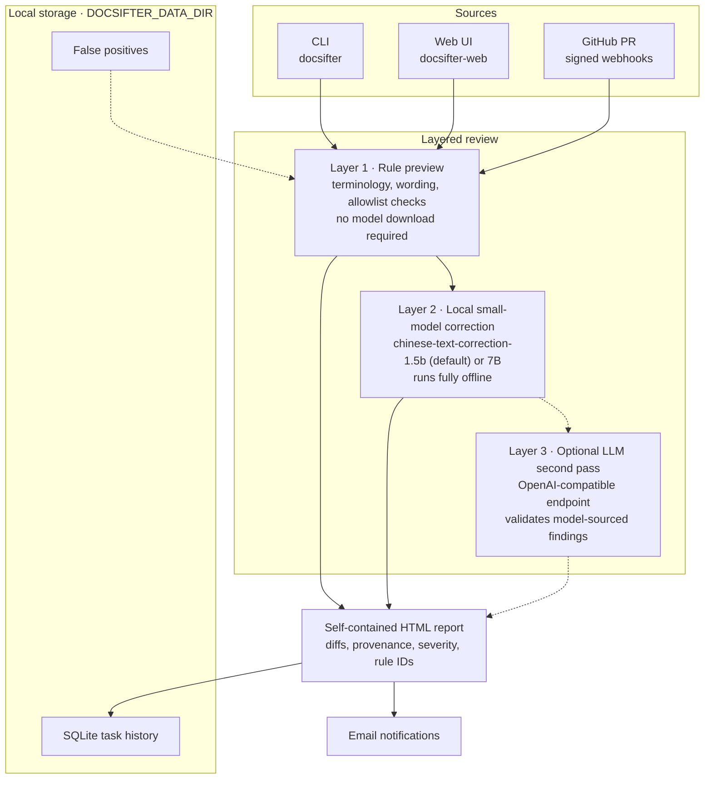

# DocSifter

[](https://github.com/heywalter/docsifter/actions/workflows/ci.yml)
[](https://www.python.org/)
[](LICENSE)

DocSifter is a local-first small-model AI reviewer for Chinese-language
Markdown, AsciiDoc, and plain-text technical documentation. It combines local model correction,
rule-based guardrails, terminology allowlists, false-positive filtering, GitHub
PR monitoring, and email notifications to help teams review documentation
before release.

Language: English | [Chinese](README-CN.md)

## Why DocSifter

Technical documentation often contains product terms, code snippets, SQL
fragments, generated examples, and markup that must not be rewritten casually.
Cloud AI tools can raise privacy and review-control concerns, generic text
correction tools can over-correct technical details, and pure rule-based checks
miss natural-language issues. DocSifter is designed for documentation teams
that want local AI assistance with engineering-grade guardrails:

- Use local small models for AI-assisted correction when deeper review is needed.
- Keep domain terms safe with rules, allowlists, and skip patterns.
- Run local batch reviews from the command line or a web UI.
- Generate HTML reports with correction details and quality metrics.
- Monitor GitHub pull requests through signed webhooks.
- Keep secrets out of source control through environment variables.

## Background Story

DocSifter started from a recurring release problem: database manuals, release
notes, and developer guides needed language review, but ordinary spellcheckers
kept touching SQL, product names, AsciiDoc syntax, and carefully chosen
technical terms. Large cloud models helped with language quality, yet they were
hard to fit into a private documentation workflow where teams wanted predictable
behavior, local execution, and review artifacts.

The project became a small local review station for technical writers and
engineers: a local small model handles AI-assisted correction, rules cover
predictable mistakes, allowlists protect domain vocabulary, and HTML reports
make the review process auditable. The lightweight rule preview path keeps the
tool easy to try, while the model runtime is installed only when a team wants
the full local AI workflow.

The name is DocSifter: a tool that sifts through documentation line by line,
patient and fine-grained. Sifting keeps what matters and sets aside what does
not belong — typos, clumsy wording, duplicated words — while everything
healthy stays on the screen: code snippets, SQL, API names, and domain terms.

## Features

- Batch scan directories for `.md`, `.adoc`, `.txt`, and related text files.
- Local small-model AI correction through `pycorrector` and local models.
- Rule-based guardrails for common wording and terminology fixes.
- Finding provenance, severity, and rule IDs in generated reports.
- False-positive management for safer repeated review.
- HTML reports with statistics, diffs, and defect-rate metrics.
- Web UI with live progress, history, configuration, and report download.
- GitHub pull request monitoring through signed webhooks.
- Email notification support for completed review tasks.
- Optional Codex-assisted context review workflow with reusable rules in
  [AGENTS.md](AGENTS.md).

## Layered AI Review



DocSifter is designed as the local review layer in a broader Docs-as-Code
workflow. The default rule preview path gives contributors an instant,
dependency-light check. The recommended local model path starts with
`shibing624/chinese-text-correction-1.5b`, which is the most CPU-friendly AI
model in the default list. The CLI and Web UI start in rule-preview mode so a
first run never downloads model weights implicitly; once AI review is selected,
the 1.5B model is the default recommended backend.

For deeper repository-aware review, teams can pair DocSifter with Codex Local
or Codex Cloud. That Codex layer is useful for issues that require project
context rather than sentence-level correction:

- Broken links, anchors, includes, and sidebar paths.
- Cross-page terminology drift and duplicated or conflicting explanations.
- Documentation that no longer matches current product behavior.
- Release-note, migration-guide, and API-reference consistency checks.

The repository includes [AGENTS.md](AGENTS.md) as a reusable review contract for
Codex-assisted work. DocSifter does not require Codex to run; Codex is an
optional deep context review layer for teams that want agent-based review on top
of local small-model checks.

## Quick Start

**Recommended — local AI correction:**

```bash
python -m venv .venv
source .venv/bin/activate
pip install "docsifter[model]"

docsifter ./examples/sample-docs --model shibing624/chinese-text-correction-1.5b
```

From a checkout, use `pip install -e ".[model]"` instead.

The first run downloads the model (~3.1 GB). Subsequent runs use the cached copy.
If the selected model or its runtime cannot be loaded, the review fails with an
actionable error instead of silently falling back to rule preview.

The download goes to the Hugging Face cache, which defaults to the home
directory. On a machine with a small system disk, point it at another volume
before the first run (set both variables to matching paths):

```bash
export HF_HOME=/Volumes/YourDisk/docsifter/model-cache/huggingface
export HUGGINGFACE_HUB_CACHE="$HF_HOME/hub"
```

Keep these as two statements. In a single `export HF_HOME=... HUGGINGFACE_HUB_CACHE=$HF_HOME/hub`,
the shell expands `$HF_HOME` before the first assignment takes effect, so the
cache silently resolves to `/hub` and the model load fails on a read-only path.

**Rule-preview only** (no model download, limited to rule-based checks):

```bash
pip install -e .
docsifter ./examples/sample-docs
```

**Web UI:**

```bash
docsifter-web
```

Open `http://localhost:8080` in your browser.

Nothing on the page is fetched from the network. Tailwind CSS and Font Awesome
are vendored under `src/docsifter/static/vendor/`, so the UI renders the same on
an air-gapped host as it does online, and no CDN sees who is running it.
Generated HTML reports are self-contained for the same reason. Regenerate the
vendored assets with `python3 tools/build_vendor_assets.py` after changing the
markup; the Tailwind file is a subset holding only the classes the UI uses.

## Installation

Requirements:

- Python 3.10+
- macOS, Linux, or Windows
- 8 GB memory minimum for trying the 1.5B model on CPU; 16 GB is recommended

Install from source:

```bash
pip install .
```

This installs the `docsifter` and `docsifter-web` commands together with the
lightweight runtime dependencies. The same dependencies are listed in
`requirements.txt` for development use. Add the `model` extra when you want
DocSifter's core local small-model correction workflow:

```bash
pip install "docsifter[model]"          # or: pip install -e ".[model]"
docsifter ./examples/sample-docs --model shibing624/chinese-text-correction-1.5b
```

`requirements-model.txt` carries the same pins for the Docker build, which
installs them before the source is copied in.

A GPU is not required for the lightweight rule-based preview workflow. Local
model correction can run without a GPU, but it is much slower and may need
substantial memory depending on the selected model. The recommended starting
model is `shibing624/chinese-text-correction-1.5b` because it is the most
CPU-friendly AI option in the supported list. Use the same-family 7B model when
you want higher-quality review and have enough memory or GPU acceleration.

## Review Rules

Built-in rules are intentionally conservative. Each shipped rule has a stable
ID, message, severity, and prose scope. Rule processing protects fenced code,
inline code, links, URLs, allowlisted terms, and markup before applying a
replacement. Context-dependent wording such as legal or domain-specific terms
should live in a project configuration instead of the global defaults.

Reports distinguish `rule`, `model`, and `rule+model` findings. A rule match no
longer prevents the selected model from checking the rest of the sentence.
Treat deterministic rule errors as CI candidates; keep model findings as human-
reviewed suggestions unless your team has validated them on its own corpus.

## Configuration

DocSifter stores mutable configuration, false-positive decisions, review
history, and generated reports in `./data` by default. Set
`DOCSIFTER_DATA_DIR` when you need a different writable location:

```bash
export DOCSIFTER_DATA_DIR="/var/lib/docsifter"
export DOCSIFTER_ALLOWED_ROOTS="/srv/docs:/srv/product-docs"
export DOCSIFTER_ADMIN_TOKEN="replace-with-a-long-random-token"
export DOCSIFTER_GITHUB_TOKEN="..."
export DOCSIFTER_EMAIL_PASSWORD="..."
export DOCSIFTER_EMAIL_RECIPIENTS="docs@example.com,review@example.com"
```

Use the sample configuration only when you want an explicit file, for example
in a project-specific script:

```bash
cp config.json.example config.local.json
docsifter ./examples/sample-docs --config config.local.json
```

See [.env.example](.env.example) for the full list of supported variables.

The Web UI may browse and review only its startup directory by default. Set
`DOCSIFTER_ALLOWED_ROOTS` to the operating-system path-separated list of roots
that Web users may access (`:` on macOS/Linux and `;` on Windows). CLI reviews
are not restricted by this Web-only boundary. Sensitive values supplied through
environment variables are never written back to `config.json`.

Useful configuration files:

- [config.json.example](config.json.example): local configuration template.
- [whitelist.json](src/docsifter/whitelist.json): terms that should not be corrected.
- [false_positives.json](src/docsifter/false_positives.json): shipped false-positive seed;
  local decisions are saved under `DOCSIFTER_DATA_DIR`.

GitHub tokens authenticate both API requests and non-interactive Git operations,
so private repositories can be reviewed without embedding credentials in clone URLs.

### Logging and Metrics

Set `DOCSIFTER_LOG_FORMAT=json` to emit single-line JSON log records (the
default is plain text) and `DOCSIFTER_LOG_LEVEL` to control verbosity. The
formatter is installed on the root logger, and every module narrates through
it: per-file progress, startup, review completion metrics, correction-guard
warnings, the email subsystem, retention, `--debug` traces, and the web
server's request and error logs.

The two streams are split on purpose. Logs go to stderr; the CLI's *result* —
the report path and the statistics block — goes to stdout, so each can be taken
on its own:

```bash
docsifter ./docs 2>/dev/null                 # just the result
DOCSIFTER_LOG_FORMAT=json docsifter ./docs \
    2>&1 1>/dev/null | jq -r .message        # just the log stream
```

The order in `2>&1 1>/dev/null` matters and cannot be swapped: `2>&1` points
stderr at what stdout currently is -- the pipe -- and only then is stdout sent
to `/dev/null`. Written the other way round the pipe receives nothing, and the
log lines spill onto the terminal instead.

`--debug` raises the level to `DEBUG` for the run, which is what surfaces the
per-line correction traces. It has nothing to do with the Flask debugger; the
web server never runs with that enabled.

The web server exposes in-process review counters and durations at `/metrics` in
Prometheus text format — no extra dependencies or exporters required.

## Usage

Review a directory:

```bash
docsifter /path/to/documents
```

Review the public sample documents:

```bash
docsifter ./examples/sample-docs
```

The sample directory intentionally contains a few common wording issues so the
first run generates an easy-to-inspect report.

Directory scans skip common generated and dependency trees such as `.git`,
`.venv`, `node_modules`, `dist`, `build`, and cache directories by default.
Symbolic links and files larger than `max_file_size_mb` (default 5) are skipped
as well: a link resolves outside the tree being reviewed, and because reviews
run one at a time, an oversized file holds up every later review.
Project-specific exclusions can be added through `skip_file_patterns`.

Write the report to a custom path:

```bash
docsifter /path/to/documents --output report.html
```

Use a custom config file:

```bash
docsifter /path/to/documents --config custom_config.json
```

Enable debug output:

```bash
docsifter /path/to/documents --debug
```

## Optional LLM Second-Pass Review

Model-sourced findings can be validated by a second LLM before they reach the
report. This layer is disabled by default and never sends data anywhere unless
you explicitly configure an endpoint. It targets OpenAI-compatible
`chat/completions` APIs (vLLM, Ollama, DashScope, OpenRouter, OpenAI, etc.), so
you can point it at a self-hosted model to keep everything on-premise.

```bash
export DOCSIFTER_LLM_REVIEW_ENABLED=true
export DOCSIFTER_LLM_ENDPOINT="https://your-endpoint.example.com/v1"
export DOCSIFTER_LLM_MODEL="qwen2.5-72b-instruct"
export DOCSIFTER_LLM_API_KEY="..."
docsifter ./examples/sample-docs --model shibing624/chinese-text-correction-1.5b
```

Behavior:

- Only findings produced by the local model (`model` or `rule+model` source) are
  reviewed; deterministic rule fixes are trusted as-is to control cost.
- `llm_max_reviews` (default 20) caps how many findings are sent **per run**,
  not per file.
- Every eligible finding carries a badge in the HTML report: `confirmed` /
  `rejected` (with confidence and reason), `skipped` (the run's budget was
  already spent), or `error` (that request failed). Rejected rows are dimmed,
  not deleted. Because eligible findings are always labeled, an unbadged row
  simply means the finding was never a candidate for review.
- Endpoint failures are reported but never abort the main review.
- The API key stays in memory only and is never written back to `config.json`.
- **The GitHub pull request path does not run this layer by default**; it also
  requires `pr_llm_enabled` (see below).

Sending documentation content to a remote endpoint moves data outside your
machine. Prefer a self-hosted endpoint when documents are confidential.

## Optional Cross-Line Context Review

Beyond per-line correction, an optional context pass asks the same
OpenAI-compatible endpoint to find problems that only appear when lines are
read together: terminology used inconsistently, statements that contradict each
other, and references to sections, figures, or links that do not exist.

```bash
export DOCSIFTER_CONTEXT_REVIEW_ENABLED=true
# Reuses DOCSIFTER_LLM_ENDPOINT / DOCSIFTER_LLM_MODEL / DOCSIFTER_LLM_API_KEY
docsifter ./examples/sample-docs --model shibing624/chinese-text-correction-1.5b
```

Behavior:

- Disabled by default; enable it explicitly with `DOCSIFTER_CONTEXT_REVIEW_ENABLED`.
- Capped at ten issues per file and 200 **extracted prose lines** per request.
  A longer document is reviewed only up to that line; the run log says how many
  lines were left out rather than silently reporting the file as fully reviewed.
- This layer sends **one whole document per file**, so its cost model differs
  from the second-pass review entirely: that pass sends only what the small
  model changed, capped at 20 findings, while this one sends the document.
  Across this project's own ten Markdown files, reviewing every file sends two
  orders of magnitude more text than the per-finding pass does.
- `context_review_scope` therefore defaults to `flagged`: only files that
  already have findings, so this layer's cost follows findings like the rest of
  the pipeline. Set it to `all` to review every file — a clean file can still
  contradict itself, which is what this layer is for — and cost follows document
  count instead.
- `context_max_files` (default 50) caps how many files one run may
  context-review, under either scope.
- If you are prepared to pay for whole documents anyway, weigh the Codex layer
  in [AGENTS.md](AGENTS.md) too: this layer sees **cross-line issues within one
  file**, while an agent that reads several files and the source gets more for
  the same tokens.
- Findings are labeled `context` in reports with the offending line numbers,
  never rewritten automatically, and exempt from the false-positive filter.
- Endpoint failures skip the context pass for that file without aborting the run.
- Like the second-pass review, **the GitHub pull request path does not run this
  layer by default**; it also requires `pr_llm_enabled`.

## Enabling the LLM Layers for Pull Requests

Both layers above apply to CLI and Web reviews only. GitHub pull request reviews
are triggered by webhooks, run unattended, and share one serialized review lock
with local reviews, so one slow pull request review blocks whoever is waiting at
the Web UI. That path therefore opts in separately:

```bash
export DOCSIFTER_PR_LLM_ENABLED=true
```

- Off by default. While off, pull request reviews stop at rule preview plus the
  local correction model.
- This is a **path switch, not a third layer.** It only permits the pull request
  path to use the two layers above; their own switches
  (`llm_review_enabled` / `context_review_enabled`) and their own ceilings
  (`llm_max_reviews` / `context_max_files`) still apply. With both layers off it
  does nothing.
- Budget for it first: the context requests one pull request makes is roughly its
  number of changed documents.
- Endpoint failures never fail the pull request review; the pass is skipped and
  logged.

### Configuring This From the Web UI

Both layers can also be configured from the **LLM review** panel at the bottom of
the Web UI's *system configuration* dialog: endpoint, model, API key, the two
toggles, the context review scope, and the `llm_max_reviews` /
`context_max_files` ceilings.

- **Environment variables win.** Any setting pinned by an environment variable is
  shown as locked and disabled in the panel, so an operator's deployment values
  cannot be quietly overridden from a browser.
- **The API key is never persisted.** A key typed into the panel is held in the
  running process only: it is not written to `config.json` and is never returned
  by any endpoint. The panel shows only whether a key is configured. Leaving the
  field blank keeps the existing key.
- Neither layer can be enabled before an endpoint and model are set, so a toggle
  cannot be switched on and then silently do nothing.
- Like the other management routes, this panel is protected by
  `DOCSIFTER_ADMIN_TOKEN`; public deployments must set that token.

## Data Retention

Review history, monitor logs, and generated report files are kept for **90 days**
by default; anything older is removed when the web server starts. Set
`retention_days` to `0` to keep everything.

```jsonc
// config.json
"retention_days": 90
```

- Deleting a history row also deletes the report file it referenced.
- Report files nothing references any more (a run that failed before its row was
  created, say) are removed by file age.
- A report still referenced by a row inside the window is kept, however old the
  file itself is.
- Cleanup runs once at startup, so it never interrupts a review in progress.

## Model Backends

The correction model runs locally through transformers (pycorrector) by
default, and can be switched to Ollama or any OpenAI-compatible endpoint:

```bash
# Local transformers (default)
export DOCSIFTER_MODEL_BACKEND=local

# Local Ollama
export DOCSIFTER_MODEL_BACKEND=ollama
export DOCSIFTER_OLLAMA_BASE_URL=http://127.0.0.1:11434

# OpenAI-compatible endpoint (vLLM, DashScope, OpenRouter, OpenAI, etc.)
export DOCSIFTER_MODEL_BACKEND=openai
export DOCSIFTER_OPENAI_BASE_URL="https://your-endpoint.example.com/v1"
export DOCSIFTER_OPENAI_API_KEY="..."
```

Behavior:

- With the `local` backend, Web/API model selection stays limited to the curated
  local model list; `ollama` / `openai` backends accept any model id
  (`qwen2.5:7b`, `gpt-4o-mini`, ...).
- All backends share the same protection pipeline: code blocks, URLs,
  placeholders, and whitelist terms are shielded before the model call, and any
  model output that fails the safety checks is discarded.
- Remote backend failures end explicitly requested tasks with an actionable
  error; there is no silent downgrade.
- The API key stays in memory only and is never written back to `config.json`.

Using a remote backend means the reviewed text is sent to that service — choose
the deployment that matches your data sensitivity.

## Web UI

Start the web server:

```bash
docsifter-web
```

Use a custom port:

```bash
docsifter --server --port 8080
```

Allow access from your local network:

```bash
export DOCSIFTER_ADMIN_TOKEN="$(python -c 'import secrets; print(secrets.token_urlsafe(32))')"
docsifter --server --port 8080 --host 0.0.0.0
```

The default host is `127.0.0.1` for local-only access. Set
`DOCSIFTER_ADMIN_TOKEN` to protect the UI and management APIs with HTTP Basic or
Bearer authentication. The browser accepts any username and uses the token as
the password. A token of at least 24 characters is mandatory when the server
binds to a non-loopback host or `DOCSIFTER_PUBLIC_URL` is configured.

## API Example

```bash
curl -X POST http://localhost:8080/api/process \
  -H "Content-Type: application/json" \
  -d '{"directory": "./examples/sample-docs", "debug": true}'
```

The endpoint returns `202 Accepted` with a task ID. Read task status and progress
from `GET /api/history/{task_id}` while the review runs in the background.
When administrator authentication is enabled, API clients must send
`Authorization: Bearer <token>`; mutating requests must also send
`X-DocSifter-Request: 1`.

Common endpoints:

- `POST /api/process`: start a review task.
- `GET /api/history/{task_id}`: read task status and details.
- `GET /api/history`: list review history.
- `GET /api/history/{task_id}/download`: download a generated report.

## GitHub PR Monitoring

DocSifter can review pull requests through signed GitHub webhooks.
Monitoring is event-driven: DocSifter does not run a background GitHub
polling service.

1. Generate a long random administrator token, then configure the public URL.
   `localhost` is not a valid GitHub webhook target:

   ```bash
   export DOCSIFTER_ADMIN_TOKEN="$(python -c 'import secrets; print(secrets.token_urlsafe(32))')"
   export DOCSIFTER_PUBLIC_URL="https://review.example.com"
   docker compose up --build
   ```

   The container uses a single-worker Gunicorn server bound to the host loopback
   interface. Terminate HTTPS at a trusted reverse proxy. Expose only
   `/api/github/webhook` without administrator authentication; keep the UI and
   every other API route protected. The webhook route still requires a valid
   GitHub signature.
2. Open the Web UI with any username (for example `docsifter`) and the
   administrator token as the password, then open GitHub Monitor.
3. On the main screen, select the review model. Then enter the repository URL in
   GitHub Monitor. Automatic reviews use the saved selection; choose the
   recommended 1.5B model only after installing the model runtime.
4. Save the monitor configuration and copy the generated Webhook URL and Secret.
   The Secret is displayed only when first created or explicitly rotated.
5. In GitHub, add a repository webhook with `application/json`, the copied
   secret, and pull request events enabled.
6. Keep "process only changed files" enabled for faster PR reviews.

Email notifications use SMTP settings from the email panel or environment
variables. Credentials are optional: leave the username empty and DocSifter
sends without authenticating, which is what an internal relay on a closed
network usually expects. "Send test email" works before notifications are
switched on, so the settings can be checked first. DocSifter stores runtime monitor state, review history, generated
reports, and logs under `DOCSIFTER_DATA_DIR`. Reviews are processed one at a
time so the local model, statistics, and report output remain isolated.
Tasks interrupted by a service restart are marked as failed instead of remaining
stuck in a running state. GitHub delivery IDs prevent webhook retries from
creating duplicate reviews while preserving later PR update events.

## Docker

Build and run with Docker:

```bash
docker build -t docsifter .
docker run --rm -p 127.0.0.1:8080:8080 \
  -v docsifter-data:/app/data docsifter
```

Or use Docker Compose:

```bash
docker compose up --build
```

The default image contains the lightweight rule-preview runtime. Build the
optional model runtime explicitly when the larger image is acceptable:

```bash
docker build --build-arg INSTALL_MODEL_RUNTIME=true -t docsifter:model .
DOCSIFTER_INSTALL_MODEL_RUNTIME=true docker compose up --build
```

Runtime state and model files are stored in the `docsifter-data` Docker volume.
The container runs as an unprivileged user with one Gunicorn worker so the
in-process model and task queues remain isolated.

## Deployment Topology

DocSifter is a deliberately single-instance service. Run exactly one
container or process per `DOCSIFTER_DATA_DIR`:

- Active review tasks are tracked in process memory and serialized with an
  in-process lock so the local model, statistics, and reports stay isolated.
- Review history is a SQLite database inside the data directory.
- Generated reports and logs are files in the same directory.

Running multiple replicas that share one data directory violates these
assumptions: task progress requests can reach a replica that does not own the
running task, webhook delivery deduplication cannot prevent duplicate PR
reviews across replicas, and extra workers contend over the SQLite database.

To scale:

- Scale vertically first (more CPU/RAM, or a larger local model).
- Offload model inference to a separate Ollama or OpenAI-compatible server via
  the remote model backends; the web tier stays lightweight.
- Keep `replicas: 1` behind your reverse proxy or load balancer.
- External task storage for multi-replica deployments is on the roadmap.

## Project Layout

```text
docsifter/
├── README.md
├── README-CN.md
├── AGENTS.md
├── CHANGELOG.md
├── CONTRIBUTING.md
├── SECURITY.md
├── pyproject.toml
├── config.json.example
├── benchmarks/
│   ├── cases.json
│   └── run_benchmark.py
├── examples/
│   └── sample-docs/
├── tools/
│   └── build_vendor_assets.py   # regenerates the vendored assets
├── src/docsifter/
│   ├── *.py                     # review pipeline, extraction, reporting
│   ├── web/                     # Flask app factory, one module per route group
│   │   ├── app.py
│   │   ├── security.py
│   │   ├── errors.py
│   │   └── routes_*.py
│   ├── templates/
│   └── static/
│       ├── js/
│       └── vendor/              # Tailwind subset + Font Awesome, no CDN
└── tests/
    ├── js/
    └── smoke/
```

## Development

Install development dependencies:

```bash
pip install -r requirements-dev.txt
```

Run tests:

```bash
python -m pytest tests/smoke
node --test tests/js/*.test.js
```

Run the review-quality benchmark (rule-preview mode):

```bash
python3 benchmarks/run_benchmark.py
```

Benchmark a remote model backend:

```bash
python3 benchmarks/run_benchmark.py --backend ollama --base-url http://127.0.0.1:11434 --model qwen2.5:7b
python3 benchmarks/run_benchmark.py --backend openai --base-url https://your-endpoint.example.com/v1 --model your-model
```

Extend text extraction to new file formats by registering an extractor — no
changes to the corrector are needed:

```python
from docsifter.extractors import register_text_extractor


@register_text_extractor((".rst",))
def extract_rst(content):
    # Return a list of (line_number, original_line, plain_text) tuples.
    ...
```

Run linting and formatting:

```bash
ruff check .
ruff format .
```

Install pre-commit hooks:

```bash
pre-commit install
```

Regenerate the vendored Web UI assets after changing the markup or the
front-end scripts, so the Tailwind subset still covers every class in use:

```bash
python3 tools/build_vendor_assets.py
```

CI runs all of the above on every pull request, plus an install of the built
wheel into a clean environment (`.github/workflows/ci.yml`).

## Project Resources

- Changelog: [CHANGELOG.md](CHANGELOG.md)
- Roadmap: [ROADMAP.md](ROADMAP.md)
- Security policy: [SECURITY.md](SECURITY.md)
- Contributing guide: [CONTRIBUTING.md](CONTRIBUTING.md)
- Codex review article: [AI content review with Codex](https://flowingdocs.com/en/blog/ai-content-review-with-codex/)
- Background article: [Building a local AI content review system](https://flowingdocs.com/en/blog/building-a-local-ai-content-review-system/)

## Security

Do not commit local secrets, tokens, report outputs, or generated databases. `config.json`, `.env`, local reports, logs, and SQLite databases are ignored by default.

If you plan to publish a repository that previously contained real credentials, rotate those credentials and rewrite the Git history before making it public.

## License

DocSifter is released under the MIT License. See [LICENSE](LICENSE).

## Acknowledgements

DocSifter builds on open-source projects including Flask, Tailwind CSS,
SQLAlchemy, SQLite, and local-model tooling such as pycorrector.

Tailwind CSS and Font Awesome Free are redistributed inside the package so the
Web UI renders offline; their licenses are recorded in
[THIRD-PARTY-NOTICES.md](THIRD-PARTY-NOTICES.md).
