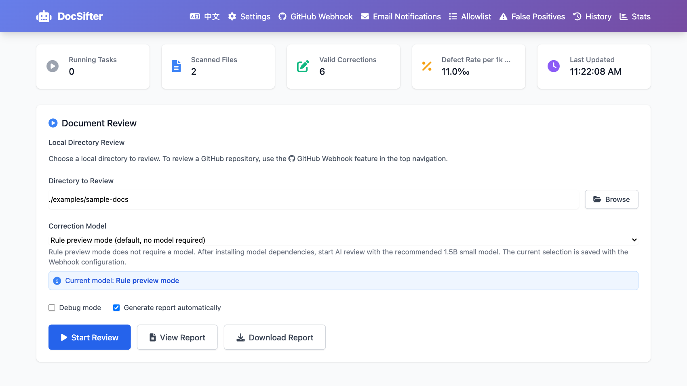

# DocSifter

[](https://github.com/heywalter/docsifter/actions/workflows/ci.yml)
[](https://www.python.org/)
[](LICENSE)

DocSifter is a local-first small-model AI reviewer for Chinese-language
Markdown, AsciiDoc, and plain-text technical documentation. It combines local model correction,
rule-based guardrails, terminology allowlists, false-positive filtering, GitHub
PR monitoring, and email notifications to help teams review documentation
before release.

Language: English | [Chinese](README-CN.md)

**[See it in action](https://flowingdocs.com/demos/docsifter/index-en.html)** -- a scrolling walkthrough with a two-and-a-half-minute video.



## Why DocSifter

Technical documentation is full of things a spellchecker must not touch: product
names, SQL, shell commands, generated examples, markup. Cloud models help with
language but are hard to fit into a private workflow; generic correction tools
over-correct the technical parts; pure rule checks miss everything else.

DocSifter sits in between. A conservative rule layer handles what it can prove,
a local small model handles the rest, and allowlists and syntax protection keep
both away from the parts that were deliberate. Nothing leaves the machine unless
you configure a remote endpoint yourself.

The name is the behaviour: sifting keeps what matters and sets aside what does
not belong -- typos, clumsy wording, duplicated words -- while code, SQL, API
names and domain terms stay on the screen.

- Batch review of `.md`, `.adoc`, `.txt` and related files, from a CLI or a Web UI.
- Every finding carries its source (`rule` / `model`), severity and rule ID.
- Self-contained HTML reports with diffs, statistics and defect rates.
- False-positive management that persists across runs.
- GitHub pull request review through signed webhooks, with email notification.
- An optional agent layer for cross-file review, contracted in [AGENTS.md](AGENTS.md).

## Layered AI Review

<picture>
  <source media="(prefers-color-scheme: dark)" srcset="docs/images/architecture-dark.svg">
  
</picture>

Both the CLI and the Web UI start at rule preview, so a first run never
downloads model weights implicitly.

Nothing here reads across files. For issues that need project context -- broken
anchors and includes, terminology drift between pages, documentation that no
longer matches the product -- pair this with a repository-aware agent such as
Codex; [AGENTS.md](AGENTS.md) is a reusable review contract for that work.
DocSifter does not require Codex to run: it is an optional layer on top of the
local checks, not a dependency.

## The Correction Model

The local layer runs one of three models, downloaded from Hugging Face the first
time it is selected:

| Model | Avg F1 | Notes |
| --- | --- | --- |
| `shibing624/chinese-text-correction-1.5b` | 0.68 | Default. About 3.1 GB and the CPU-friendly option; every DocSifter measurement below used it. |
| `twnlp/ChineseErrorCorrector3-4B` | **0.85** | Highest of the three, from [ChineseErrorCorrector](https://github.com/TW-NLP/ChineseErrorCorrector), and small enough for a 12 GB card. Not verified here. |
| `shibing624/chinese-text-correction-7b` | 0.82 | Same family as the default, larger. Not verified here: it does not fit the card this was built on. |

Avg F1 is the mean over SIGHAN-2015, EC-LAW and MCSC from the pycorrector
leaderboard, measured on a Tesla V100 -- the per-dataset breakdown is on each
[model card](https://huggingface.co/shibing624/chinese-text-correction-1.5b) and
in ChineseErrorCorrector, which publishes the same evaluation. Those numbers
describe a model on its own.

What DocSifter adds around one is a separate question, which
[`benchmarks/README.md`](benchmarks/README.md) answers against a 76-case corpus:

| Category | Rules alone | Rules + 1.5B model |
| --- | --- | --- |
| terminology (24) | 24 corrected, 0 wrong | 24 corrected, 0 wrong |
| typo (19) | 0 corrected | 15 corrected, 3 wrong |
| grammar (13) | 1 corrected, 0 wrong | 3 corrected, 4 wrong |
| protection (16 negatives) | 16 left untouched | 16 left untouched |

Read that as the shape of each layer, not an accuracy figure: 76 cases cannot
support one, and one grammar case moves that row eight points. What it shows is
why both layers exist. Typos are what the model is for, since rules cannot touch
them. Grammar is where it is weakest, wrong about as often as right -- which is
why every finding carries its source, and a `model` finding is a suggestion
rather than a correction.


### Using other models

Those two are the local allowlist -- the Web UI starts no review outside it --
but not the limit. Three layers take a model, and each can point elsewhere:

| Layer | What it does | Switch |
| --- | --- | --- |
| Correction backend | Replaces the local runtime with Ollama or any OpenAI-compatible endpoint, which accept any model id (`qwen2.5:7b`, `gpt-4o-mini`, ...). | `DOCSIFTER_MODEL_BACKEND=local\|ollama\|openai` |
| [Second-pass review](#optional-llm-layers) | Sends what the small model changed to a larger model for a verdict. Off by default. | `DOCSIFTER_LLM_REVIEW_ENABLED` |
| [Cross-line context review](#optional-llm-layers) | Sends whole documents to catch contradictions and broken references. Off by default. | `DOCSIFTER_CONTEXT_REVIEW_ENABLED` |

```bash
export DOCSIFTER_MODEL_BACKEND=ollama
export DOCSIFTER_OLLAMA_BASE_URL=http://127.0.0.1:11434

# or any OpenAI-compatible endpoint: vLLM, DashScope, OpenRouter, OpenAI
export DOCSIFTER_MODEL_BACKEND=openai
export DOCSIFTER_OPENAI_BASE_URL="https://your-endpoint.example.com/v1"
export DOCSIFTER_OPENAI_API_KEY="..."
```

Every backend shares the protection pipeline, fails loudly rather than
downgrading silently, and keeps its API key in memory. A remote one means the
text leaves the machine, so self-host it when the documents are confidential --
and score it against the corpus before trusting it:

```bash
python3 benchmarks/run_benchmark.py --backend ollama --base-url http://127.0.0.1:11434 --model qwen2.5:7b
```

### Hardware

| Path | What it needs |
| --- | --- |
| Rule preview | Nothing in particular: no model download, no GPU. |
| 1.5B on CPU | Works, and is slow. 8 GB of system memory at a minimum, 16 GB is more comfortable. |
| 1.5B on GPU | The recommended setup, and what this was built on: an RTX 3060 with 12 GB holds the model comfortably. |
| 4B on GPU | Untested here, but at fp16 its weights come to roughly 8 GB, so a 12 GB card has room for it. |
| 7B on GPU | Untested here. At fp16 its weights alone come to roughly 14 GB, past what a 12 GB card holds, so it wants a larger one. |

Neither the 4B nor the 7B has been run here -- the 7B does not fit 12 GB and no
larger card was available, and the 4B was added on the strength of its published
score. Treat both rows as arithmetic rather than experience.

A GPU is a recommendation, not a requirement: every layer runs on CPU and the
rule layer loads no model at all. What it buys is turnaround -- the model card's
six queries per second came from a V100, and CPU is well below that.

## Quick Start

**Recommended — local AI correction:**

```bash
python -m venv .venv
source .venv/bin/activate
pip install "docsifter[model] @ git+https://github.com/heywalter/docsifter.git"

docsifter ./examples/sample-docs --model shibing624/chinese-text-correction-1.5b
```

From a checkout, use `pip install -e ".[model]"` instead.

The first run downloads the model (~3.1 GB) and caches it. A model that cannot
be loaded fails the review with an actionable error rather than falling back to
rule preview silently.

The cache defaults to the home directory. On a small system disk, redirect it
before that first run -- both variables, matching paths:

```bash
export HF_HOME=/Volumes/YourDisk/docsifter/model-cache/huggingface
export HUGGINGFACE_HUB_CACHE="$HF_HOME/hub"
```

Two statements, not one: in `export HF_HOME=... HUGGINGFACE_HUB_CACHE=$HF_HOME/hub`
the shell expands `$HF_HOME` before the first assignment lands, so the cache
resolves to `/hub` and the load fails on a read-only path.

**Rule preview only**, with no model download:

```bash
pip install git+https://github.com/heywalter/docsifter.git
docsifter ./examples/sample-docs
```

Other things the CLI takes:

```bash
docsifter /path/to/documents --output report.html
docsifter /path/to/documents --config custom_config.json
docsifter /path/to/documents --debug      # per-line traces, at DEBUG level
```

Scans skip `.git`, `.venv`, `node_modules`, `dist`, `build` and the usual caches,
along with symbolic links and files over `max_file_size_mb` (default 5) -- a link
resolves outside the tree, and reviews are serialized, so one oversized file
holds up everything behind it. Add your own exclusions with `skip_file_patterns`.

Python 3.10+ on macOS, Linux or Windows; see [Hardware](#hardware) for what each
path needs. `pip install -e ".[model]"` installs from a checkout. DocSifter is
not on PyPI yet, so both commands above install straight from this repository.

**Web UI:**

```bash
docsifter-web
```

Open `http://localhost:8080` in your browser.

Nothing on the page is fetched from the network: Tailwind and Font Awesome are
vendored under `src/docsifter/static/vendor/`, so the UI renders identically on
an air-gapped host and no CDN sees who is running it. Generated reports are
self-contained for the same reason.

## Review Rules

Rules are deliberately conservative: each has a stable ID, message, severity and
prose scope, and fenced code, inline code, links, URLs, allowlisted terms and
markup are protected before any replacement. Keep context-dependent wording in a
project configuration, not the global defaults.

Reports mark findings `rule`, `model` or `rule+model`, and a rule match does not
stop the model checking the rest of the sentence. Deterministic rule errors are
CI candidates; model findings stay human-reviewed suggestions until your team
has validated them on its own corpus.

## Configuration

Mutable config, false-positive decisions, history and reports live in `./data`.
[.env.example](.env.example) lists every supported variable; the ones that
matter most:

```bash
export DOCSIFTER_DATA_DIR="/var/lib/docsifter"
export DOCSIFTER_ALLOWED_ROOTS="/srv/docs:/srv/product-docs"
export DOCSIFTER_ADMIN_TOKEN="replace-with-a-long-random-token"
export DOCSIFTER_GITHUB_TOKEN="..."
export DOCSIFTER_EMAIL_PASSWORD="..."
export DOCSIFTER_EMAIL_RECIPIENTS="docs@example.com,review@example.com"
```

For a file instead, copy [config.json.example](config.json.example) and pass
`--config`; environment values are never written back to it. The Web UI may
browse only its startup directory unless `DOCSIFTER_ALLOWED_ROOTS` widens it
(`:` on macOS/Linux, `;` on Windows) -- the CLI is not bound by that.

Edit [whitelist.json](src/docsifter/whitelist.json) early: it holds the terms
that must never be corrected. [false_positives.json](src/docsifter/false_positives.json)
seeds the filter, and your own decisions are saved under `DOCSIFTER_DATA_DIR`.

### Logging and Metrics

`DOCSIFTER_LOG_FORMAT=json` emits single-line JSON records instead of text, and
`DOCSIFTER_LOG_LEVEL` sets verbosity. Every module narrates through that one
formatter -- progress, review metrics, correction-guard warnings, email,
retention, `--debug` traces, and the web server's request logs.

The two streams are split on purpose: logs to stderr, the CLI's *result* (report
path and statistics) to stdout, so each can be taken alone:

```bash
docsifter ./docs 2>/dev/null                 # just the result
DOCSIFTER_LOG_FORMAT=json docsifter ./docs \
    2>&1 1>/dev/null | jq -r .message        # just the log stream
```

That order cannot be swapped: `2>&1` points stderr at what stdout currently is
-- the pipe -- and only then does stdout go to `/dev/null`. Reversed, the pipe
gets nothing and the logs spill onto the terminal.

`--debug` raises the run to `DEBUG`, surfacing the per-line traces. It has
nothing to do with the Flask debugger, which the server never enables.

The web server exposes in-process review counters and durations at `/metrics` in
Prometheus text format — no extra dependencies or exporters required.

## Optional LLM Layers

Two layers can hand work to a larger model over any OpenAI-compatible
`chat/completions` API. Both are off by default and send nothing until you
configure an endpoint.

```bash
export DOCSIFTER_LLM_ENDPOINT="https://your-endpoint.example.com/v1"
export DOCSIFTER_LLM_MODEL="qwen2.5-72b-instruct"
export DOCSIFTER_LLM_API_KEY="..."

export DOCSIFTER_LLM_REVIEW_ENABLED=true      # second-pass review
export DOCSIFTER_CONTEXT_REVIEW_ENABLED=true  # cross-line context review
export DOCSIFTER_PR_LLM_ENABLED=true          # also allow both on the PR path
```

**Second-pass review** checks what the small model changed, one finding at a
time; rule fixes are trusted as-is. `llm_max_reviews` (default 20) caps the
count per *run*. Each finding sent gets a badge in the report -- `confirmed` /
`rejected` with a reason, `skipped` once the budget is spent, or `error` -- and
rejected rows are dimmed, not deleted.

**Cross-line context review** looks for what only shows up across lines:
inconsistent terminology, contradictions, references to sections or links that
do not exist. Findings are labeled `context`, never rewritten automatically, and
exempt from the false-positive filter. Capped at ten issues per file and 200
extracted lines per request, with the log saying how many lines were left out.

Budget the second one separately: it sends **one whole document per file**, where
the first sends only changed sentences capped at 20 -- across this project's own
ten Markdown files, two orders of magnitude more text. Hence
`context_review_scope` defaults to `flagged`, covering only files that already
have findings; `all` covers every file, since a clean one can still contradict
itself. `context_max_files` (default 50) caps either scope. If you are paying
for whole documents anyway, an agent that reads several files gets more for the
same tokens.

`DOCSIFTER_PR_LLM_ENABLED` is a **path switch, not a third layer**: pull request
reviews run unattended and share one serialized lock with local reviews, so they
opt in separately. The two layers' own switches and ceilings still apply, and
with both off it does nothing. Endpoint failures anywhere are logged and skipped,
never aborting a review.

The Web UI's **LLM review** panel sets all of this. Values pinned by environment
variables show as locked so a browser cannot override a deployment, a key typed
there is never written to `config.json`, and neither layer can be switched on
before an endpoint and model exist.

## Data Retention

History, monitor logs and report files are kept 90 days (`retention_days`; `0`
keeps everything), cleaned once at web startup so a review is never interrupted.
Deleting a history row deletes the report it referenced, orphaned files go by
age, and a report still referenced from inside the window is kept however old.

## Web UI

```bash
docsifter-web                              # http://localhost:8080
docsifter --server --port 8080             # custom port

# reachable from the network, which requires a token
export DOCSIFTER_ADMIN_TOKEN="$(python -c 'import secrets; print(secrets.token_urlsafe(32))')"
docsifter --server --port 8080 --host 0.0.0.0
```

The default host is `127.0.0.1` for local-only access. Set
`DOCSIFTER_ADMIN_TOKEN` to protect the UI and management APIs with HTTP Basic or
Bearer authentication. The browser accepts any username and uses the token as
the password. A token of at least 24 characters is mandatory when the server
binds to a non-loopback host or `DOCSIFTER_PUBLIC_URL` is configured.

Every run produces a self-contained HTML report: the statistics for the run,
then each finding with its original line, the suggestion, the rule that fired
and its severity. Any finding can be marked a false positive from the report
itself, and the filter applies to later reviews.


## API Example

```bash
curl -X POST http://localhost:8080/api/process \
  -H "Content-Type: application/json" \
  -d '{"directory": "./examples/sample-docs", "debug": true}'
```

Returns `202 Accepted` and a task id; `GET /api/history/{task_id}` reports
status, `/download` fetches the report, `GET /api/history` lists past runs. With
an administrator token set, clients send `Authorization: Bearer <token>`, and
mutating requests also `X-DocSifter-Request: 1`.

## GitHub PR Monitoring

Pull request review is event-driven through signed webhooks; nothing polls
GitHub in the background.

1. Set an administrator token and a public URL -- `localhost` is not a valid
   webhook target -- then start the service:

   ```bash
   export DOCSIFTER_ADMIN_TOKEN="$(python -c 'import secrets; print(secrets.token_urlsafe(32))')"
   export DOCSIFTER_PUBLIC_URL="https://review.example.com"
   docker compose up --build
   ```

   Terminate HTTPS at a trusted reverse proxy. Expose only
   `/api/github/webhook` unauthenticated -- it still demands a valid GitHub
   signature -- and keep every other route behind the token.
2. Open the Web UI (any username, the token as password), pick the review model
   on the main screen, then enter the repository URL under GitHub Monitor.
3. Save the configuration and copy the Webhook URL and Secret. The Secret is
   shown only when first created or explicitly rotated.
4. Add a repository webhook in GitHub with `application/json`, that secret, and
   pull request events enabled. Leave "process only changed files" on.

Runtime state, history, reports and logs live under `DOCSIFTER_DATA_DIR`.
Reviews run one at a time so the model, statistics and report output stay
isolated; a task interrupted by a restart is marked failed rather than left
running; and GitHub delivery ids stop a retry from producing a duplicate review
while still allowing later updates to the same pull request.

Email notifications use the SMTP settings from the email panel or the
environment. Credentials are optional -- an empty username sends without
authenticating, which is what an internal relay usually expects -- and "Send
test email" works before notifications are switched on, so the settings can be
checked first.

## Docker

```bash
docker compose up --build

# or plain Docker
docker build -t docsifter .
docker run --rm -p 127.0.0.1:8080:8080 -v docsifter-data:/app/data docsifter

# the model runtime is opt-in, and makes the image much larger
docker build --build-arg INSTALL_MODEL_RUNTIME=true -t docsifter:model .
DOCSIFTER_INSTALL_MODEL_RUNTIME=true docker compose up --build
```

State and model files live in the `docsifter-data` volume. The container runs
unprivileged with one Gunicorn worker, so the in-process model and task queue
stay isolated.

## Deployment Topology

One process per `DOCSIFTER_DATA_DIR`, deliberately. Tasks live in process memory
behind an in-process lock, history is a SQLite file, reports are files beside
it; replicas sharing a data directory break all three. Scale up rather than out,
move inference to an Ollama or OpenAI-compatible server to keep the web tier
light, and keep `replicas: 1` behind the proxy.

## Development

Setup, tests, linting, the benchmark and the vendored-asset rebuild are in
[CONTRIBUTING.md](CONTRIBUTING.md); CI runs all of them on every pull request.

New file formats need an extractor, not a change to the corrector:

```python
from docsifter.extractors import register_text_extractor


@register_text_extractor((".rst",))
def extract_rst(content):
    # Return a list of (line_number, original_line, plain_text) tuples.
    ...
```

## Project Resources

- Changelog: [CHANGELOG.md](CHANGELOG.md)
- Roadmap: [ROADMAP.md](ROADMAP.md)
- Security policy: [SECURITY.md](SECURITY.md)
- Contributing guide: [CONTRIBUTING.md](CONTRIBUTING.md)
- Demo page: [DocSifter, scroll to sift](https://flowingdocs.com/demos/docsifter/index-en.html)
- Announcement: [DocSifter is now open source](https://flowingdocs.com/en/blog/docsifter-open-source/)
- Codex review article: [AI content review with Codex](https://flowingdocs.com/en/blog/ai-content-review-with-codex/)
- Background article: [Building a local AI content review system](https://flowingdocs.com/en/blog/building-a-local-ai-content-review-system/)

## Security

Do not commit local secrets, tokens, report outputs, or generated databases. `config.json`, `.env`, local reports, logs, and SQLite databases are ignored by default.

If you plan to publish a repository that previously contained real credentials, rotate those credentials and rewrite the Git history before making it public.

## License

DocSifter is released under the MIT License. See [LICENSE](LICENSE).

## Acknowledgements

DocSifter builds on open-source projects including Flask, Tailwind CSS,
SQLAlchemy, SQLite, and local-model tooling such as pycorrector.

Tailwind CSS and Font Awesome Free are redistributed inside the package so the
Web UI renders offline; their licenses are recorded in
[THIRD-PARTY-NOTICES.md](THIRD-PARTY-NOTICES.md).
